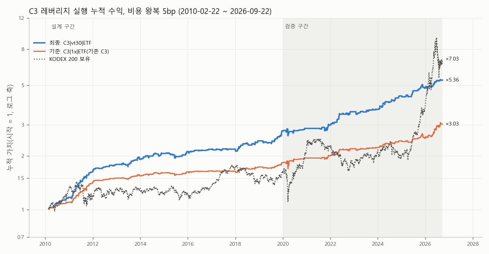

# 5차 전략 탐색 · c3_levered: D2 잔차 갭(C3/C2) 레버리지·크기·필터

## 요약



- 최종 사양(설계 구간 규칙으로 선택): **C3|vt30|ETF** — 선택 근거: 설계 CAGR ≥ 10% 후보 중 설계 샤프 최대.
- 설계(2010-02-22~2019-12-30): CAGR 11.1%, 승률 62.6%, 샤프 +1.72, MDD -6.5%, 거래 24.4회/년.
- 검증(2020-01-02~2026-09-22, 비용 5bp): CAGR 10.6%, 승률 66.3%, 거래당 순 +39.5bp(NW t +4.45), 샤프 +1.33, MDD -8.4%. 같은 구간 KODEX 200 보유 CAGR 25.0%, MDD -40.8%.
- 최근 급등(2025-06-09~) 제외 검증: CAGR 9.3%, 승률 66.9%, MDD -8.4%.
- 단, 위 수치는 '09:00 시가로 신호를 계산하고 같은 09:00 단일가에 체결'한다는 가정(공통 규약 4의 '봉 마감 결정 → 다음 봉 시가 체결'을 어김) 위에 있다.
- 규약대로 09:00 봉(09:00:00~09:00:59) 마감 뒤 09:01 첫 체결에 들어가면(KODEX 1분봉, 100거래, 2023-01~2026-09): 최종 사양 CAGR 7.1%·승률 57.0%·거래당 순 +25.5bp(NW t +2.36) — 같은 기간 09:00 단일가 가정 CAGR 12.0%·승률 67.0%. 거래당 총수익의 62%만 남는다. 첫 1분 동안 KODEX 가 단일가보다 평균 +17.3bp 오른 몫(시가 단일가 저평가)이 엣지의 큰 부분이다.
- 목표 점검(검증 구간, 비용 5bp): 시가 단일가 가정 CAGR 10.6%(≥10% 충족), 승률 66.3%(≥51% 충족). 규약상 실행형 09:01 진입(2023-01~2026-09만 가능) CAGR 7.1%(미달), 승률 57.0%(충족). 시가 단일가를 잡으려면 08:59 예상지수·ETF 예상체결가로 미리 주문해야 하며, 그 근사 오차는 과거 자료가 없어 검증하지 못했다.

## 1. 규칙

```
R5 · c3_levered: D2 잔차 갭 신호(C3/C2)를 바꾸지 않고 실행 차량·크기·필터 1개로 연 10% 근처를 노린다 (5차 전략 탐색)

신호(변경 없음): bt_d2_2010_2026.signals() 의 R3-C2(지수 갭 잔차 z ≥ 1), R3-C3(C2 + KODEX 시가가 지수 대비 싸게 열림).
  C3 ⊂ C2 이므로 'C3 ∪ C2' = C2. 계층(TIER) = C3 날 노출 2배, C2 전용 날 노출 1배.
매매: T 09:00 시가 단일가 매수 → T 15:30 종가 단일가 매도(1일 1회, 롱 전용). 신호도 09:00 시가를 쓴다(기존 가정 그대로).
  실거래 가능성은 아래 '분봉 실행 점검'에서 09:01·09:02·09:05·09:10 진입으로 따로 잰다.
노출 w (자본 대비 배수, 0~2):
  1x: w = 신호 / lev: w = 2·신호 / tier: w = C2 + C3
  zlin: w = 신호·clip(z_index, 1, 2) / zstep: w = 신호·(1 + 1[z_index ≥ 1.5])
  vt20·vt30: w = 신호·clip(목표 / σ̂, 0, 2), σ̂ = 코스피200 일간 종가수익 직전 20일 SD×√252 (T−1 종가까지)
  필터(T−1 종가까지 정보, 코스피200 지수 종가): ma20up 종가 > MA20 / ma60up 종가 > MA60 / noup2 전일 수익 ≤ +2% / ma20dn 종가 < MA20(눌림)
차량:
  ETF(주식계좌): w ≤ 1 → 069500 비중 w, 1 < w ≤ 2 → 069500 (2−w) + 122630 (w−1). 수익 = 각 ETF 시가→종가. 비용 = 비중 × 왕복 5bp(스트레스 069500 7bp, 122630 8bp)
  IDX(미니 코스피200 선물 프록시): 수익 = w × 코스피200 지수 시가→종가, 비용 = w × 2bp(스트레스 3bp).
    ETF 시가 할인 몫을 잃고, 지수 시가를 같은 지수 시가에 체결한다고 두므로 선물 실체결과 다를 수 있다(아래 진단).
  2003~2009 추가 표본 외: 122630 이 없어 2x KODEX 경로 합성(lev = (1 + 2·cc)/(1 + 2·gap) − 1, KODEX 수정주가)으로 대체.
구간(사전 고정): 설계 2010-02-22(122630 상장, 모든 변형 공통 시작)~2019-12-31 / 검증 2020-01-01~ 마지막 신호일(미국 종가 자료 끝)
  / 검증 중 2025-06-05 까지(최근 급등 제외) / 2025-06-09~ / 추가 표본 외 2003~2009(지수·KODEX 만).
  주의: C2·C3 신호 자체는 2차(2020~2025-06 B 구간)·3차(2003~2009)에서 이미 본 신호다. 여기서 새로 고르는 것은 차량·크기·필터뿐이다.
그리드(42개): A 차량·계층 10, B z 크기 8, C 변동성 목표 8, D 필터 16 (전부 grid.csv 에 기록).
최종 선택 규칙(설계 지표만, 실행 전 고정):
  후보 = 차량 ETF(주식계좌로 실행 가능한 069500/122630 조합). IDX 변형은 파생계좌가 필요하고 지수 시가 편향이 있어 후보에서 빼고 참고로만 보고한다.
  조건: 설계 거래 ≥ 15회/년, 설계 MDD ≥ −25%.
  1순위: 조건을 만족하고 설계 CAGR ≥ 10% 인 후보 중 설계 샤프 최대. 없으면 조건을 만족하는 후보 중 설계 CAGR 최대.
  동률(샤프 소수 둘째 자리까지 같음)이면 더 단순한 쪽(필터 없음 > 크기 규칙 없음). 2·3위는 같은 순서의 다음 변형. 검증 성과로는 고르지 않는다.
분봉 실행 점검: KODEX 200 1분봉(끝시각 라벨, 09:01 봉 = 09:00:00~09:00:59), 2023-01-02~2026-09-29 신호일.
  진입 = 해당 시각 이후 첫 체결(거래량 > 0 인 첫 봉의 시가; 09:01 진입 = 09:02 라벨 봉), 청산 = 15:30 봉 종가(종가 단일가).
  레버리지 경로는 2x KODEX 경로로 근사: (1 + 2·cc)/(1 + 2·(K_t/K_전일종가 − 1)) − 1.
실행: python topics/r5_c3_levered.py [--no-ledger]
```

## 2. 그리드 설계 성과(상위 15, 규칙 순위) — 전체 42개는 grid.csv

|   순위 | 변형                |   설계 거래/년 | 설계 승률   |   설계 거래당순bp | 설계 CAGR   |   설계 샤프 | 설계 MDD   |
|-----:|:------------------|----------:|:--------|------------:|:----------|--------:|:---------|
|    1 | C3|vt30|ETF       |      24.4 | 62.6%   |        44.2 | 11.1%     |    1.72 | -6.5%    |
|    2 | C3|lev|ETF        |      24.4 | 63.0%   |        57.1 | 14.5%     |    1.68 | -6.5%    |
|    3 | C3|lev|ETF|noup2  |      24.4 | 63.0%   |        57.1 | 14.5%     |    1.68 | -6.5%    |
|    4 | C3|zlin|ETF       |      24.4 | 63.4%   |        42.7 | 10.7%     |    1.58 | -5.2%    |
|    5 | C2|vt30|ETF       |      33.2 | 62.2%   |        34.6 | 11.9%     |    1.55 | -8.5%    |
|    6 | TIER|tier|ETF     |      33.2 | 60.3%   |        40.1 | 13.8%     |    1.52 | -7.3%    |
|    7 | C2|lev|ETF        |      33.2 | 62.5%   |        44.3 | 15.3%     |    1.49 | -9.5%    |
|    8 | C2|lev|ETF|noup2  |      33.1 | 62.4%   |        44.3 | 15.2%     |    1.49 | -9.5%    |
|    9 | C3|zstep|ETF      |      24.4 | 62.1%   |        40.8 | 10.2%     |    1.48 | -6.5%    |
|   10 | C2|zlin|ETF       |      33.2 | 61.6%   |        30.8 | 10.4%     |    1.26 | -10.1%   |
|   11 | C2|zstep|ETF      |      33.2 | 60.6%   |        29   | 9.7%      |    1.18 | -10.2%   |
|   12 | C2|lev|ETF|ma20dn |      20.8 | 59.7%   |        45.2 | 9.4%      |    1.07 | -9.5%    |
|   13 | C3|lev|ETF|ma20dn |      15.4 | 59.7%   |        58.8 | 9.2%      |    1.2  | -8.6%    |
|   14 | C2|vt20|ETF       |      33.2 | 62.5%   |        24.8 | 8.4%      |    1.46 | -7.6%    |
|   15 | C3|vt20|ETF       |      24.4 | 63.0%   |        31.7 | 7.9%      |    1.61 | -5.9%    |


참고: 지수(선물 프록시, 2bp) 변형 설계 성과(후보 아님)

| 변형                |   설계 거래/년 | 설계 승률   | 설계 CAGR   |   설계 샤프 | 설계 MDD   |
|:------------------|----------:|:--------|:----------|--------:|:---------|
| C2|lev|IDX        |      33.2 | 54.7%   | 5.7%      |    0.63 | -17.5%   |
| TIER|tier|IDX     |      33.2 | 54.7%   | 5.5%      |    0.68 | -14.6%   |
| C3|lev|IDX        |      24.4 | 53.6%   | 5.2%      |    0.67 | -12.9%   |
| C3|lev|IDX|noup2  |      24.4 | 53.6%   | 5.2%      |    0.67 | -12.9%   |
| C2|vt30|IDX       |      33.2 | 54.7%   | 4.6%      |    0.66 | -17.2%   |
| C2|zlin|IDX       |      33.2 | 54.7%   | 4.1%      |    0.56 | -13.7%   |
| C3|zlin|IDX       |      24.4 | 53.6%   | 3.9%      |    0.64 | -9.8%    |
| C2|zstep|IDX      |      33.2 | 54.7%   | 3.8%      |    0.51 | -14.6%   |
| C3|zstep|IDX      |      24.4 | 53.6%   | 3.7%      |    0.6  | -10.6%   |
| C3|vt30|IDX       |      24.4 | 53.6%   | 3.6%      |    0.62 | -12.9%   |
| C2|vt20|IDX       |      33.2 | 54.7%   | 3.3%      |    0.61 | -15.3%   |
| C3|lev|IDX|ma20dn |      15.4 | 52.3%   | 3.1%      |    0.45 | -12.9%   |
| C2|1x|IDX         |      33.2 | 54.7%   | 2.9%      |    0.63 | -9.1%    |
| C3|1x|IDX         |      24.4 | 53.6%   | 2.6%      |    0.67 | -6.6%    |
| C3|vt20|IDX       |      24.4 | 53.6%   | 2.4%      |    0.53 | -11.7%   |
| C3|lev|IDX|ma20up |       8.9 | 55.8%   | 2.0%      |    0.66 | -9.6%    |
| C3|lev|IDX|ma60up |       9.6 | 51.6%   | 1.4%      |    0.44 | -7.9%    |


## 3. 최종 사양과 2·3위, 기준선의 구간별 성과(비용 5bp, 괄호 밖 CAGR 스트레스는 ETF 7·8bp / 지수 3bp)

| 구분                      | 구간              | 기간                    |   거래 |   거래/년 |   평균w | 승률    |   거래당순bp |   NW t | CAGR   | CAGR(스트레스)   |   샤프 | MDD    |   칼마 | 보유 CAGR   | 보유 MDD   |
|:------------------------|:----------------|:----------------------|-----:|-------:|------:|:------|---------:|-------:|:-------|:-------------|-----:|:-------|-----:|:----------|:---------|
| 최종 C3|vt30|ETF          | 설계              | 2010-02-22~2019-12-30 |  235 |   24.4 |  1.8  | 62.6% |     44.2 |   5.5  | 11.1%  | 10.4%        | 1.72 | -6.5%  | 1.72 | 5.2%      | -27.4%   |
| 최종 C3|vt30|ETF          | 검증              | 2020-01-02~2026-09-22 |  172 |   26.3 |  1.39 | 66.3% |     39.5 |   4.45 | 10.6%  | 9.9%         | 1.33 | -8.4%  | 1.26 | 25.0%     | -40.8%   |
| 최종 C3|vt30|ETF          | 검증(~2025-06-05) | 2020-01-02~2025-06-05 |  127 |   24   |  1.59 | 66.9% |     38.5 |   3.99 | 9.3%   | 8.7%         | 1.15 | -8.4%  | 1.11 | 7.1%      | -34.6%   |
| 최종 C3|vt30|ETF          | 2025-06-09~     | 2025-06-09~2026-09-22 |   45 |   35.7 |  0.82 | 64.4% |     42.4 |   2.21 | 16.0%  | 15.4%        | 2.18 | -4.7%  | 3.4  | 139.0%    | -40.8%   |
| 최종 C3|vt30|ETF          | 추가OOS 2003~2009 | 2003-01-02~2009-12-30 |  151 |   21.9 |  1.26 | 78.1% |     91.4 |   7.45 | 21.7%  | 21.1%        | 2.43 | -6.2%  | 3.48 | 18.5%     | -52.7%   |
| 2위 C3|lev|ETF           | 설계              | 2010-02-22~2019-12-30 |  235 |   24.4 |  2    | 63.0% |     57.1 |   5.41 | 14.5%  | 13.7%        | 1.68 | -6.5%  | 2.23 | 5.2%      | -27.4%   |
| 2위 C3|lev|ETF           | 검증              | 2020-01-02~2026-09-22 |  172 |   26.3 |  2    | 66.9% |     57.2 |   3.94 | 14.9%  | 14.0%        | 1.02 | -18.1% | 0.82 | 25.0%     | -40.8%   |
| 2위 C3|lev|ETF           | 검증(~2025-06-05) | 2020-01-02~2025-06-05 |  127 |   24   |  2    | 67.7% |     46.3 |   3.35 | 10.7%  | 9.9%         | 0.83 | -18.1% | 0.59 | 7.1%      | -34.6%   |
| 2위 C3|lev|ETF           | 2025-06-09~     | 2025-06-09~2026-09-22 |   45 |   35.7 |  2    | 64.4% |     88   |   2.34 | 34.3%  | 32.9%        | 1.62 | -10.0% | 3.44 | 139.0%    | -40.8%   |
| 2위 C3|lev|ETF           | 추가OOS 2003~2009 | 2003-01-02~2009-12-30 |  151 |   21.9 |  2    | 78.1% |    169.5 |   5.88 | 43.1%  | 42.2%        | 2.29 | -9.1%  | 4.71 | 18.5%     | -52.7%   |
| 3위 C3|lev|ETF|noup2     | 설계              | 2010-02-22~2019-12-30 |  235 |   24.4 |  2    | 63.0% |     57.1 |   5.41 | 14.5%  | 13.7%        | 1.68 | -6.5%  | 2.23 | 5.2%      | -27.4%   |
| 3위 C3|lev|ETF|noup2     | 검증              | 2020-01-02~2026-09-22 |  163 |   24.9 |  2    | 68.1% |     63.3 |   3.61 | 15.8%  | 15.0%        | 1.09 | -18.1% | 0.87 | 25.0%     | -40.8%   |
| 3위 C3|lev|ETF|noup2     | 검증(~2025-06-05) | 2020-01-02~2025-06-05 |  124 |   23.4 |  2    | 69.4% |     53   |   3.36 | 12.2%  | 11.4%        | 0.94 | -18.1% | 0.67 | 7.1%      | -34.6%   |
| 3위 C3|lev|ETF|noup2     | 2025-06-09~     | 2025-06-09~2026-09-22 |   39 |   30.9 |  2    | 64.1% |     96   |   1.85 | 32.2%  | 31.0%        | 1.58 | -12.8% | 2.51 | 139.0%    | -40.8%   |
| 3위 C3|lev|ETF|noup2     | 추가OOS 2003~2009 | 2003-01-02~2009-12-30 |  143 |   20.7 |  2    | 77.6% |    164.1 |   5.45 | 38.8%  | 38.0%        | 2.16 | -9.1%  | 4.24 | 18.5%     | -52.7%   |
| 기준선(기존 C3 1x) C3|1x|ETF | 설계              | 2010-02-22~2019-12-30 |  235 |   24.4 |  1    | 61.7% |     26.3 |   4.93 | 6.5%   | 6.0%         | 1.55 | -3.6%  | 1.82 | 5.2%      | -27.4%   |
| 기준선(기존 C3 1x) C3|1x|ETF | 검증              | 2020-01-02~2026-09-22 |  172 |   26.3 |  1    | 64.0% |     30.1 |   3.95 | 7.9%   | 7.4%         | 1.06 | -9.4%  | 0.84 | 25.0%     | -40.8%   |
| 기준선(기존 C3 1x) C3|1x|ETF | 검증(~2025-06-05) | 2020-01-02~2025-06-05 |  127 |   24   |  1    | 63.8% |     22.9 |   3.11 | 5.4%   | 4.9%         | 0.8  | -9.4%  | 0.57 | 7.1%      | -34.6%   |
| 기준선(기존 C3 1x) C3|1x|ETF | 2025-06-09~     | 2025-06-09~2026-09-22 |   45 |   35.7 |  1    | 64.4% |     50.6 |   2.7  | 19.2%  | 18.4%        | 1.9  | -5.6%  | 3.43 | 139.0%    | -40.8%   |
| 기준선(기존 C3 1x) C3|1x|ETF | 추가OOS 2003~2009 | 2003-01-02~2009-12-30 |  151 |   21.9 |  1    | 78.1% |     82.6 |   5.71 | 19.4%  | 18.9%        | 2.24 | -4.9%  | 4    | 18.5%     | -52.7%   |
| 지수 참고 C2|lev|IDX        | 설계              | 2010-02-22~2019-12-30 |  320 |   33.2 |  2    | 54.7% |     18.2 |   2.33 | 5.7%   | 5.0%         | 0.63 | -17.5% | 0.33 | 5.2%      | -27.4%   |
| 지수 참고 C2|lev|IDX        | 검증              | 2020-01-02~2026-09-22 |  264 |   40.3 |  2    | 59.1% |     25.6 |   1.69 | 8.3%   | 7.5%         | 0.48 | -21.8% | 0.38 | 25.0%     | -40.8%   |
| 지수 참고 C2|lev|IDX        | 검증(~2025-06-05) | 2020-01-02~2025-06-05 |  191 |   36.1 |  2    | 59.7% |     10.8 |   0.77 | 2.6%   | 1.8%         | 0.24 | -21.8% | 0.12 | 7.1%      | -34.6%   |
| 지수 참고 C2|lev|IDX        | 2025-06-09~     | 2025-06-09~2026-09-22 |   73 |   57.8 |  2    | 57.5% |     64.3 |   1.68 | 36.2%  | 34.7%        | 1.05 | -15.3% | 2.36 | 139.0%    | -40.8%   |
| 지수 참고 C2|lev|IDX        | 추가OOS 2003~2009 | 2003-01-02~2009-12-30 |  204 |   29.6 |  2    | 65.2% |     70.2 |   3.75 | 21.6%  | 20.8%        | 1.31 | -14.3% | 1.5  | 18.5%     | -52.7%   |


- 추가OOS 2003~2009 의 레버리지 몫은 122630 이 없어 2x KODEX 경로 합성값이다. 이 시기 KODEX 시가 저평가 몫이 커서(기준선 거래당 순 +80bp 대) 수치가 높다. 신호 자체의 이 시기 판정은 3차 보고서에 있다.

## 4. 연도별(최종 사양, 비용 5bp)

|   연도 | 구간    |   거래 | 승률    |   거래당순bp | 연수익   | MDD   | C3 1x 연수익   | KODEX200 보유   |
|-----:|:------|-----:|:------|---------:|:------|:------|:------------|:--------------|
| 2003 | 추가OOS |   20 | 80.0% |     73.6 | 15.5% | -2.9% | 13.8%       | 35.3%         |
| 2004 | 추가OOS |   24 | 79.2% |     58.3 | 14.8% | -0.9% | 15.2%       | 11.9%         |
| 2005 | 추가OOS |   16 | 75.0% |    123.5 | 21.3% | -2.1% | 11.6%       | 56.8%         |
| 2006 | 추가OOS |   19 | 78.9% |     96.5 | 19.9% | -0.8% | 11.8%       | 6.7%          |
| 2007 | 추가OOS |   33 | 90.9% |    133.2 | 54.3% | -1.7% | 38.2%       | 33.5%         |
| 2008 | 추가OOS |   29 | 65.5% |     79.3 | 25.1% | -6.1% | 43.1%       | -38.3%        |
| 2009 | 추가OOS |   10 | 70.0% |     42.9 | 4.2%  | -4.2% | 5.2%        | 54.3%         |
| 2010 | 설계    |   18 | 77.8% |     88.7 | 17.1% | -1.1% | 10.2%       | 23.9%         |
| 2011 | 설계    |   36 | 80.6% |     93.4 | 39.2% | -2.4% | 28.0%       | -10.7%        |
| 2012 | 설계    |   14 | 78.6% |     69.9 | 10.2% | -0.6% | 6.6%        | 11.3%         |
| 2013 | 설계    |   29 | 48.3% |     23.5 | 6.8%  | -4.4% | 2.9%        | 1.1%          |
| 2014 | 설계    |   24 | 58.3% |     32.1 | 7.8%  | -3.6% | 4.0%        | -6.6%         |
| 2015 | 설계    |   24 | 54.2% |     11   | 2.5%  | -6.5% | 1.4%        | -0.1%         |
| 2016 | 설계    |   18 | 61.1% |     16.8 | 3.0%  | -2.0% | 1.1%        | 10.2%         |
| 2017 | 설계    |   19 | 42.1% |      1.1 | 0.2%  | -1.6% | -0.3%       | 27.1%         |
| 2018 | 설계    |   26 | 65.4% |     42.5 | 11.4% | -2.7% | 5.6%        | -17.3%        |
| 2019 | 설계    |   27 | 59.3% |     48.3 | 13.7% | -3.6% | 5.9%        | 14.4%         |
| 2020 | 검증    |   18 | 66.7% |     21.6 | 3.3%  | -8.4% | 6.1%        | 35.6%         |
| 2021 | 검증    |   19 | 63.2% |     24.8 | 4.5%  | -4.3% | 2.9%        | 3.0%          |
| 2022 | 검증    |   35 | 65.7% |     50   | 18.8% | -2.3% | 9.7%        | -24.2%        |
| 2023 | 검증    |   19 | 57.9% |     17.3 | 3.2%  | -3.2% | 1.4%        | 24.9%         |
| 2024 | 검증    |   29 | 75.9% |     60.7 | 18.9% | -2.1% | 9.2%        | -9.4%         |
| 2025 | 검증    |   21 | 71.4% |     48.9 | 10.6% | -4.7% | 3.5%        | 94.2%         |
| 2026 | 검증    |   31 | 61.3% |     34.4 | 11.1% | -1.6% | 20.2%       | 82.0%         |


## 5. 차량 점검

122630 실제 시가→종가와 2x KODEX 합성의 C3 날 평균(2010-02-22~):

|   C3 날수 |   122630 실제 bp |   2x KODEX 합성 bp |   KODEX 1x bp |   지수 bp |
|--------:|---------------:|-----------------:|--------------:|--------:|
|     407 |           62.1 |             65.3 |          32.9 |    13.5 |


선물 프록시 진단(선물이 09:00 에 같이 열리던 2014-07-08~2023-07-28, 신호일 평균 시가→종가 bp, 총수익):

| 신호   |   날수 |   지수 시가→종가 bp |   선물 시가→종가 bp |   KODEX 시가→종가 bp |   122630 시가→종가 bp |
|:-----|-----:|--------------:|--------------:|-----------------:|------------------:|
| C3   |  212 |           5.6 |          19.9 |             21.6 |                40 |
| C2   |  300 |           5.4 |          14.2 |             15.4 |                31 |


- 신호일에는 지수 자체의 시가→종가가 작고(수 bp), 선물·KODEX·122630 의 시가 단일가가 지수보다 싸게 형성된 몫이 수익의 대부분이다. 엣지의 핵심은 '갭 지속'보다 '시가 단일가 저평가 회복'에 가깝다.
- 그래서 지수 프록시(IDX) 변형은 선물을 09:00 단일가에 잡는 경로보다 낮게 나오고, 단일가 이후 선물 진입에 더 가깝다. 2023-07-31 이후 선물은 08:45 에 열려 09:00 에는 단일가가 없다.

## 6. 분봉 실행 점검(KODEX 200 1분봉, 2023-01-02~)

신호일 중 장 시작이 09:00 이 아닌 날(첫 체결 > 09:01 라벨, 예: 1월 첫 거래일·수능일 10:00 개장): 2025-01-02, 2026-03-05, 2026-06-08. 이런 날은 지연 진입가가 사실상 그날 첫 체결이다.

C3 날 단일가 대비 지연 진입가 변화(bp, KODEX 원 가격):

| 진입    |   count |   mean |   50% |
|:------|--------:|-------:|------:|
| 09:01 |     100 |   17.3 |   9.2 |
| 09:02 |     100 |   18.1 |  12.9 |
| 09:05 |     100 |   13.2 |  12.3 |
| 09:10 |     100 |   16.4 |  14.1 |


같은 신호일(2023-01~)의 평균 총수익 비교(bp):

| 신호   |   날수 |   KODEX 09:00 단일가→종가 bp |   KODEX 09:01 진입→종가 bp |   코스피200 지수 시가→종가 bp |   122630 시가→종가 bp |
|:-----|-----:|------------------------:|-----------------------:|---------------------:|------------------:|
| C3   |  100 |                    37.7 |                   20.4 |                 15.6 |              66.7 |
| C2   |  160 |                    19.2 |                    7.4 |                 19.5 |              39.9 |


진입 시각별 성과(비용 5bp). 레버리지 몫: '09:00 단일가'는 122630 실제, '(2x 합성)'과 지연 진입은 2x KODEX 경로 근사. '남는몫' = 거래당 총수익 / 같은 경로의 09:00 단일가 총수익(레버리지 포함 변형은 2x 합성 기준). 09:01 진입이 공통 규약(봉 마감 결정 → 다음 봉 시가)에 맞는 실행형이다:

| 변형          | 진입               |   거래 | 승률    |   거래당총bp |   거래당순bp |   NW t | CAGR   | CAGR스트레스   | MDD    |   샤프 | 남는몫   |
|:------------|:-----------------|-----:|:------|---------:|---------:|-------:|:-------|:-----------|:-------|-----:|:------|
| C3|1x|ETF   | 09:00 단일가        |  100 | 64.0% |     37.7 |     32.7 |   3.33 | 9.3%   | 8.7%       | -5.6%  |  1.4 | 100%  |
| C3|1x|ETF   | 09:01            |  100 | 57.0% |     20.4 |     15.4 |   1.64 | 4.2%   | 3.6%       | -5.8%  |  0.7 | 54%   |
| C3|1x|ETF   | 09:02            |  100 | 57.0% |     19.6 |     14.6 |   1.5  | 3.9%   | 3.4%       | -7.0%  |  0.6 | 52%   |
| C3|1x|ETF   | 09:05            |  100 | 54.0% |     24.5 |     19.5 |   1.89 | 5.4%   | 4.8%       | -5.6%  |  0.9 | 65%   |
| C3|1x|ETF   | 09:10            |  100 | 55.0% |     21.3 |     16.3 |   1.72 | 4.4%   | 3.9%       | -5.8%  |  0.8 | 57%   |
| C3|lev|ETF  | 09:00 단일가        |  100 | 67.0% |     66.7 |     61.7 |   3.24 | 17.6%  | 16.7%      | -10.0% |  1.3 | 89%   |
| C3|lev|ETF  | 09:00 단일가(2x 합성) |  100 | 65.0% |     74.6 |     69.6 |   3.62 | 20.3%  | 19.3%      | -10.6% |  1.5 | 100%  |
| C3|lev|ETF  | 09:01            |  100 | 57.0% |     40.8 |     35.8 |   1.96 | 9.5%   | 8.6%       | -10.5% |  0.8 | 55%   |
| C3|lev|ETF  | 09:02            |  100 | 58.0% |     39.1 |     34.1 |   1.8  | 9.1%   | 8.2%       | -12.7% |  0.8 | 52%   |
| C3|lev|ETF  | 09:05            |  100 | 56.0% |     48.6 |     43.6 |   2.16 | 12.0%  | 11.1%      | -10.5% |  1   | 65%   |
| C3|lev|ETF  | 09:10            |  100 | 58.0% |     42.1 |     37.1 |   2    | 10.1%  | 9.2%       | -10.9% |  0.9 | 56%   |
| C2|1x|ETF   | 09:00 단일가        |  160 | 60.0% |     19.2 |     14.2 |   1.41 | 6.0%   | 5.1%       | -11.4% |  0.7 | 100%  |
| C2|1x|ETF   | 09:01            |  160 | 55.0% |      7.4 |      2.4 |   0.25 | 0.6%   | -0.3%      | -12.4% |  0.1 | 38%   |
| C2|1x|ETF   | 09:02            |  160 | 56.2% |      8.1 |      3.1 |   0.35 | 1.0%   | 0.1%       | -10.4% |  0.2 | 42%   |
| C2|1x|ETF   | 09:05            |  160 | 51.2% |     10.5 |      5.5 |   0.64 | 2.0%   | 1.1%       | -10.0% |  0.3 | 55%   |
| C2|1x|ETF   | 09:10            |  160 | 53.1% |     11.9 |      6.9 |   0.82 | 2.7%   | 1.8%       | -11.8% |  0.3 | 62%   |
| C2|lev|ETF  | 09:00 단일가        |  160 | 63.1% |     39.9 |     34.9 |   1.82 | 14.7%  | 13.2%      | -20.7% |  0.8 | 105%  |
| C2|lev|ETF  | 09:00 단일가(2x 합성) |  160 | 61.3% |     37.9 |     32.9 |   1.68 | 13.8%  | 12.3%      | -20.9% |  0.8 | 100%  |
| C2|lev|ETF  | 09:01            |  160 | 55.0% |     14.8 |      9.8 |   0.54 | 2.7%   | 1.4%       | -22.6% |  0.2 | 39%   |
| C2|lev|ETF  | 09:02            |  160 | 56.9% |     16.2 |     11.2 |   0.65 | 3.4%   | 2.1%       | -19.0% |  0.3 | 43%   |
| C2|lev|ETF  | 09:05            |  160 | 52.5% |     21.1 |     16.1 |   0.96 | 5.6%   | 4.2%       | -18.3% |  0.4 | 56%   |
| C2|lev|ETF  | 09:10            |  160 | 55.6% |     23.4 |     18.4 |   1.13 | 6.8%   | 5.4%       | -21.6% |  0.5 | 62%   |
| C3|vt30|ETF | 09:00 단일가        |  100 | 67.0% |     46.1 |     41.8 |   3.83 | 12.0%  | 11.4%      | -4.7%  |  1.7 | 97%   |
| C3|vt30|ETF | 09:00 단일가(2x 합성) |  100 | 64.0% |     47.7 |     43.5 |   3.99 | 12.5%  | 11.9%      | -4.7%  |  1.8 | 100%  |
| C3|vt30|ETF | 09:01            |  100 | 57.0% |     29.8 |     25.5 |   2.36 | 7.1%   | 6.5%       | -4.9%  |  1.1 | 62%   |
| C3|vt30|ETF | 09:02            |  100 | 57.0% |     28   |     23.8 |   2.2  | 6.6%   | 6.0%       | -5.9%  |  1   | 59%   |
| C3|vt30|ETF | 09:05            |  100 | 54.0% |     31.7 |     27.5 |   2.56 | 7.7%   | 7.1%       | -4.7%  |  1.2 | 67%   |
| C3|vt30|ETF | 09:10            |  100 | 56.0% |     28.1 |     23.8 |   2.21 | 6.6%   | 6.0%       | -3.6%  |  1.1 | 59%   |


하위 구간(2023~2024 / 2025~2026-09):

| 변형          | 진입               | 구간           |   거래 | 승률    |   거래당총bp |   거래당순bp |   NW t | CAGR   | CAGR스트레스   | MDD    |   샤프 | 남는몫   |
|:------------|:-----------------|:-------------|-----:|:------|---------:|---------:|-------:|:-------|:-----------|:-------|-----:|:------|
| C3|1x|ETF   | 09:00 단일가        | 2023~2024    |   48 | 66.7% |     26.5 |     21.5 |   3.08 | 5.4%   | 4.9%       | -1.9%  |  1.4 | 100%  |
| C3|1x|ETF   | 09:00 단일가        | 2025~2026-09 |   52 | 61.5% |     48   |     43   |   2.49 | 14.0%  | 13.3%      | -5.6%  |  1.6 | 100%  |
| C3|1x|ETF   | 09:01            | 2023~2024    |   48 | 58.3% |     14.2 |      9.2 |   1.27 | 2.2%   | 1.7%       | -2.5%  |  0.6 | 54%   |
| C3|1x|ETF   | 09:01            | 2025~2026-09 |   52 | 55.8% |     26.2 |     21.2 |   1.24 | 6.4%   | 5.8%       | -5.8%  |  0.8 | 54%   |
| C3|1x|ETF   | 09:02            | 2023~2024    |   48 | 60.4% |     14.9 |      9.9 |   1.31 | 2.4%   | 1.9%       | -2.4%  |  0.6 | 56%   |
| C3|1x|ETF   | 09:02            | 2025~2026-09 |   52 | 53.8% |     24   |     19   |   1.07 | 5.7%   | 5.1%       | -7.0%  |  0.7 | 50%   |
| C3|1x|ETF   | 09:05            | 2023~2024    |   48 | 54.2% |     15.5 |     10.5 |   1.34 | 2.6%   | 2.1%       | -3.0%  |  0.7 | 59%   |
| C3|1x|ETF   | 09:05            | 2025~2026-09 |   52 | 53.8% |     32.9 |     27.9 |   1.51 | 8.7%   | 8.1%       | -5.6%  |  1.1 | 68%   |
| C3|1x|ETF   | 09:10            | 2023~2024    |   48 | 56.2% |     12.3 |      7.3 |   1.08 | 1.8%   | 1.3%       | -1.9%  |  0.5 | 46%   |
| C3|1x|ETF   | 09:10            | 2025~2026-09 |   52 | 53.8% |     29.7 |     24.7 |   1.46 | 7.7%   | 7.0%       | -5.8%  |  1   | 62%   |
| C3|lev|ETF  | 09:00 단일가        | 2023~2024    |   48 | 68.8% |     50.8 |     45.8 |   3.04 | 11.7%  | 10.8%      | -3.9%  |  1.5 | 96%   |
| C3|lev|ETF  | 09:00 단일가        | 2025~2026-09 |   52 | 65.4% |     81.4 |     76.4 |   2.26 | 25.0%  | 23.9%      | -10.0% |  1.4 | 86%   |
| C3|lev|ETF  | 09:00 단일가(2x 합성) | 2023~2024    |   48 | 66.7% |     52.7 |     47.7 |   3.46 | 12.2%  | 11.4%      | -3.7%  |  1.5 | 100%  |
| C3|lev|ETF  | 09:00 단일가(2x 합성) | 2025~2026-09 |   52 | 63.5% |     94.7 |     89.7 |   2.65 | 30.5%  | 29.3%      | -10.6% |  1.7 | 100%  |
| C3|lev|ETF  | 09:01            | 2023~2024    |   48 | 58.3% |     28.3 |     23.3 |   1.63 | 5.6%   | 4.8%       | -4.7%  |  0.7 | 54%   |
| C3|lev|ETF  | 09:01            | 2025~2026-09 |   52 | 55.8% |     52.4 |     47.4 |   1.43 | 14.3%  | 13.2%      | -10.5% |  0.9 | 55%   |
| C3|lev|ETF  | 09:02            | 2023~2024    |   48 | 60.4% |     29.7 |     24.7 |   1.66 | 6.0%   | 5.2%       | -4.5%  |  0.8 | 56%   |
| C3|lev|ETF  | 09:02            | 2025~2026-09 |   52 | 55.8% |     47.9 |     42.9 |   1.24 | 12.9%  | 11.8%      | -12.7% |  0.8 | 51%   |
| C3|lev|ETF  | 09:05            | 2023~2024    |   48 | 56.2% |     31   |     26   |   1.68 | 6.3%   | 5.5%       | -5.7%  |  0.8 | 59%   |
| C3|lev|ETF  | 09:05            | 2025~2026-09 |   52 | 55.8% |     64.9 |     59.9 |   1.66 | 19.0%  | 17.9%      | -10.5% |  1.2 | 69%   |
| C3|lev|ETF  | 09:10            | 2023~2024    |   48 | 60.4% |     24.4 |     19.4 |   1.44 | 4.7%   | 3.9%       | -3.4%  |  0.7 | 46%   |
| C3|lev|ETF  | 09:10            | 2025~2026-09 |   52 | 55.8% |     58.5 |     53.5 |   1.62 | 16.7%  | 15.6%      | -10.9% |  1.1 | 62%   |
| C2|1x|ETF   | 09:00 단일가        | 2023~2024    |   75 | 61.3% |     12.8 |      7.8 |   0.84 | 2.9%   | 2.1%       | -5.5%  |  0.5 | 100%  |
| C2|1x|ETF   | 09:00 단일가        | 2025~2026-09 |   85 | 58.8% |     24.9 |     19.9 |   1.17 | 9.8%   | 8.7%       | -11.4% |  0.8 | 100%  |
| C2|1x|ETF   | 09:01            | 2023~2024    |   75 | 57.3% |      4.3 |     -0.7 |  -0.07 | -0.4%  | -1.2%      | -6.7%  | -0   | 34%   |
| C2|1x|ETF   | 09:01            | 2025~2026-09 |   85 | 52.9% |     10   |      5   |   0.32 | 1.8%   | 0.8%       | -12.4% |  0.2 | 40%   |
| C2|1x|ETF   | 09:02            | 2023~2024    |   75 | 60.0% |      5.8 |      0.8 |   0.08 | 0.1%   | -0.6%      | -6.1%  |  0.1 | 45%   |
| C2|1x|ETF   | 09:02            | 2025~2026-09 |   85 | 52.9% |     10.1 |      5.1 |   0.35 | 1.9%   | 0.9%       | -10.4% |  0.2 | 41%   |
| C2|1x|ETF   | 09:05            | 2023~2024    |   75 | 50.7% |      5   |      0   |   0    | -0.1%  | -0.9%      | -5.4%  |  0   | 39%   |
| C2|1x|ETF   | 09:05            | 2025~2026-09 |   85 | 51.8% |     15.4 |     10.4 |   0.72 | 4.6%   | 3.5%       | -10.0% |  0.4 | 62%   |
| C2|1x|ETF   | 09:10            | 2023~2024    |   75 | 52.0% |      4   |     -1   |  -0.12 | -0.5%  | -1.3%      | -5.7%  | -0.1 | 32%   |
| C2|1x|ETF   | 09:10            | 2025~2026-09 |   85 | 54.1% |     18.9 |     13.9 |   1    | 6.5%   | 5.5%       | -11.8% |  0.6 | 76%   |
| C2|lev|ETF  | 09:00 단일가        | 2023~2024    |   75 | 64.0% |     28.9 |     23.9 |   1.27 | 9.0%   | 7.8%       | -9.3%  |  0.8 | 114%  |
| C2|lev|ETF  | 09:00 단일가        | 2025~2026-09 |   85 | 62.4% |     49.5 |     44.5 |   1.39 | 21.6%  | 19.8%      | -20.7% |  0.9 | 101%  |
| C2|lev|ETF  | 09:00 단일가(2x 합성) | 2023~2024    |   75 | 62.7% |     25.3 |     20.3 |   1.11 | 7.5%   | 6.3%       | -10.3% |  0.7 | 100%  |
| C2|lev|ETF  | 09:00 단일가(2x 합성) | 2025~2026-09 |   85 | 60.0% |     49   |     44   |   1.33 | 21.6%  | 19.7%      | -20.9% |  0.9 | 100%  |
| C2|lev|ETF  | 09:01            | 2023~2024    |   75 | 57.3% |      8.6 |      3.6 |   0.2  | 0.8%   | -0.4%      | -11.4% |  0.1 | 34%   |
| C2|lev|ETF  | 09:01            | 2025~2026-09 |   85 | 52.9% |     20.3 |     15.3 |   0.5  | 5.0%   | 3.4%       | -22.6% |  0.3 | 41%   |
| C2|lev|ETF  | 09:02            | 2023~2024    |   75 | 60.0% |     11.5 |      6.5 |   0.35 | 1.9%   | 0.7%       | -10.7% |  0.2 | 45%   |
| C2|lev|ETF  | 09:02            | 2025~2026-09 |   85 | 54.1% |     20.4 |     15.4 |   0.55 | 5.2%   | 3.7%       | -19.0% |  0.3 | 42%   |
| C2|lev|ETF  | 09:05            | 2023~2024    |   75 | 52.0% |     10   |      5   |   0.3  | 1.4%   | 0.2%       | -10.3% |  0.2 | 40%   |
| C2|lev|ETF  | 09:05            | 2025~2026-09 |   85 | 52.9% |     30.9 |     25.9 |   0.94 | 10.8%  | 9.1%       | -18.3% |  0.5 | 63%   |
| C2|lev|ETF  | 09:10            | 2023~2024    |   75 | 56.0% |      7.9 |      2.9 |   0.18 | 0.6%   | -0.5%      | -10.6% |  0.1 | 31%   |
| C2|lev|ETF  | 09:10            | 2025~2026-09 |   85 | 55.3% |     37.2 |     32.2 |   1.2  | 14.5%  | 12.8%      | -21.6% |  0.7 | 76%   |
| C3|vt30|ETF | 09:00 단일가        | 2023~2024    |   48 | 68.8% |     48.5 |     43.5 |   3.39 | 11.1%  | 10.4%      | -3.2%  |  1.6 | 97%   |
| C3|vt30|ETF | 09:00 단일가        | 2025~2026-09 |   52 | 65.4% |     43.9 |     40.3 |   2.21 | 13.1%  | 12.6%      | -4.7%  |  1.8 | 97%   |
| C3|vt30|ETF | 09:00 단일가(2x 합성) | 2023~2024    |   48 | 66.7% |     50.2 |     45.2 |   3.71 | 11.6%  | 10.8%      | -3.1%  |  1.7 | 100%  |
| C3|vt30|ETF | 09:00 단일가(2x 합성) | 2025~2026-09 |   52 | 61.5% |     45.4 |     41.9 |   2.26 | 13.7%  | 13.1%      | -4.7%  |  1.9 | 100%  |
| C3|vt30|ETF | 09:01            | 2023~2024    |   48 | 58.3% |     29.5 |     24.5 |   1.98 | 6.0%   | 5.3%       | -3.3%  |  0.9 | 59%   |
| C3|vt30|ETF | 09:01            | 2025~2026-09 |   52 | 55.8% |     30   |     26.4 |   1.43 | 8.3%   | 7.8%       | -4.9%  |  1.2 | 66%   |
| C3|vt30|ETF | 09:02            | 2023~2024    |   48 | 60.4% |     30.5 |     25.6 |   1.96 | 6.3%   | 5.6%       | -3.1%  |  1   | 61%   |
| C3|vt30|ETF | 09:02            | 2025~2026-09 |   52 | 53.8% |     25.7 |     22.1 |   1.22 | 6.9%   | 6.4%       | -5.9%  |  1.1 | 57%   |
| C3|vt30|ETF | 09:05            | 2023~2024    |   48 | 54.2% |     32.2 |     27.3 |   2    | 6.8%   | 6.1%       | -3.1%  |  1.1 | 64%   |
| C3|vt30|ETF | 09:05            | 2025~2026-09 |   52 | 53.8% |     31.3 |     27.7 |   1.6  | 8.8%   | 8.3%       | -4.7%  |  1.4 | 69%   |
| C3|vt30|ETF | 09:10            | 2023~2024    |   48 | 58.3% |     24.3 |     19.3 |   1.52 | 4.7%   | 4.0%       | -2.8%  |  0.8 | 48%   |
| C3|vt30|ETF | 09:10            | 2025~2026-09 |   52 | 53.8% |     31.6 |     28   |   1.58 | 8.9%   | 8.4%       | -3.6%  |  1.4 | 69%   |


추정: 2023~2026 에서 잰 지연 손실(기존 C3 1x 거래당 총수익 차이)을 노출 1 당 거래마다 빼서 최종 사양 전 구간에 덧씌운 값(가정에 기반한 추정):

| 진입    |   노출1당 차감bp | 구간              | 승률    |   거래당순bp | CAGR   | MDD    |   샤프 |
|:------|------------:|:----------------|:------|---------:|:-------|:-------|-----:|
| 09:01 |        17.3 | 설계              | 55.3% |     13.1 | 3.1%   | -20.9% | 0.53 |
| 09:01 |        17.3 | 검증              | 57.0% |     15.6 | 3.9%   | -8.5%  | 0.54 |
| 09:01 |        17.3 | 검증(~2025-06-05) | 55.9% |     11.1 | 2.4%   | -8.5%  | 0.34 |
| 09:02 |        18.1 | 설계              | 55.3% |     11.6 | 2.7%   | -22.5% | 0.47 |
| 09:02 |        18.1 | 검증              | 57.0% |     14.4 | 3.6%   | -8.5%  | 0.5  |
| 09:02 |        18.1 | 검증(~2025-06-05) | 55.9% |      9.7 | 2.1%   | -8.5%  | 0.3  |
| 09:05 |        13.2 | 설계              | 56.6% |     20.5 | 4.9%   | -15.3% | 0.83 |
| 09:05 |        13.2 | 검증              | 60.5% |     21.3 | 5.4%   | -8.5%  | 0.73 |
| 09:05 |        13.2 | 검증(~2025-06-05) | 59.1% |     17.6 | 4.0%   | -8.5%  | 0.54 |


## 7. 읽는 법·주의

- 신호(C2·C3)는 바꾸지 않았다. 신호 자체는 이전 차수에서 2020~2025-06 과 2003~2009 를 이미 본 것이라, 여기서의 '검증'은 차량·크기·필터 선택에 대해서만 표본 외다.
- 레버리지(122630)는 수익과 손실을 거의 두 배로 키울 뿐 샤프를 바꾸지 않는다. CAGR 10% 는 C3 의 1x 엣지(연 6~8%)를 1.4~2배 노출로 키운 결과다. 변동성 목표(vt30)는 변동성이 큰 시기(2020, 2025~26)에 노출을 줄여 검증 MDD 를 레버리지 고정(−18%)보다 낮췄다(−8%).
- 분봉 점검의 레버리지 몫은 2x KODEX 경로 근사다. 2023~2026 C3 날 09:00 단일가 기준 근사가 122630 실제보다 거래당 +7.9bp(2x 노출 기준) 높아, 지연 진입 레버리지 수치는 그만큼 낙관적일 수 있다.
- 검증 구간 KODEX 200 보유 CAGR 이 25%(2025~26 급등)라 절대 수익은 보유보다 낮다. 이 전략의 장점은 노출 약 10%·MDD 한 자릿수라는 점이다.
- 가장 큰 위험은 실행이다. 백테스트는 09:00 시가로 계산한 신호를 같은 09:00 단일가에 체결한다. 실거래에서 08:59 예상지수로 미리 주문하지 않으면 09:01 이후 진입이 되고, 6절처럼 거래당 총수익이 C3 는 약 절반, C2 는 약 60% 줄어든다(2023~2026 분봉).
- 레버리지 ETF 매수에는 금융투자교육원 사전교육 이수와 증권사 기본예탁금 요건이 있다(증권사에서 확인 필요). 미니 코스피200 선물은 파생상품 계좌(사전교육·모의거래·기본예탁금)가 필요하다.
- 시행한 변형 수: 42개(전부 grid.csv·장부 R5_C3_LEVERED). 선택은 설계 지표 규칙만 썼다.
- 파일: daily_returns.csv(일별 노출·순수익), trades.csv(최종 사양 거래, 분봉 지연 진입 수익 포함), grid.csv, detail.csv, entry_delay.csv, equity.png.