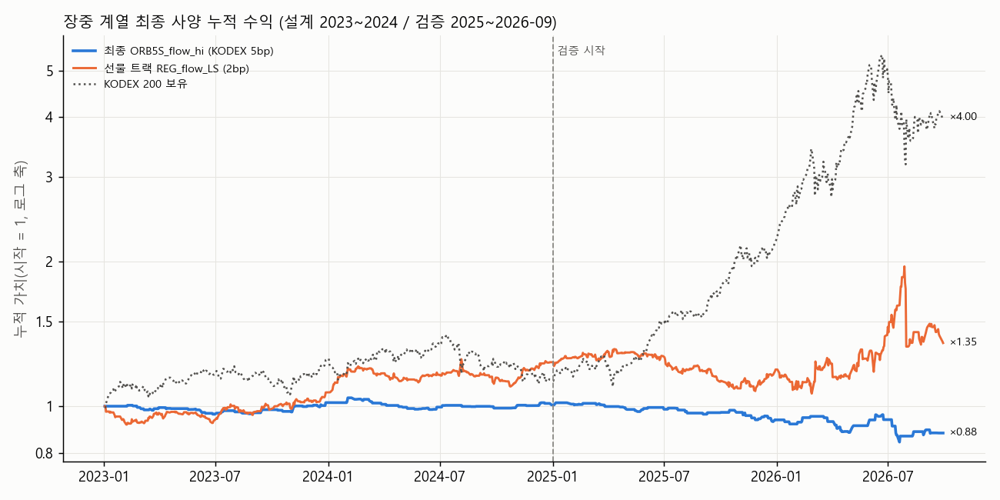

# 5차 전략 탐색 — 장중 계열(KODEX 200 1분봉 → 1/5/10/60/120분)

```
5차 전략 탐색 — 장중 계열(R5_INTRADAY_MIN): KODEX 200 1분봉으로 1/5/10/60/120분 규칙을 설계·검증한다.

자료
- 팀 저장소 KODEX 200 1분봉 2023-01-02 ~ 2026-09-29(912일). 봉 시각은 끝 시각(09:01 봉 = 09:00:00~09:00:59),
  09:01~15:30 봉만 쓴다. 15:20 봉(15:19:00~15:19:59)이 마지막 접속매매 봉, 15:30 봉 종가 = 종가 단일가.
- 늦게 연 날(1월 첫 거래일·수능일 10:00 개장, 7일)은 매매하지 않는다(무포지션, 수익 0으로 날수에는 포함).
- 체결: 봉 종가에 판단 → 다음 봉 시가 체결. 청산은 15:30 종가 단일가(장 마감 동시호가 주문). 15:20~15:29 체결 없음.
- 사전 정보(진입 전에 알 수 있는 것만): D2 잔차 갭 z(코스피200 지수 09:00 시가 갭을 직전 미국 S&P500 누적수익으로 회귀한
  250일 롤링 잔차 z, r3_d2 와 같은 계산), 지수 시가 갭 부호, 전일(T−1) 외국인 코스피200 선물 순매수 수량의 과거 250일
  분위(상위 40% = q60 초과, 하위 40% = q40 미만), 전일 지수 종가 vs 20일 이동평균, 직전 20일 장중 고저폭 중앙값.

그리드(48개, 실행 전 고정)
- IM 장중 모멘텀(Gao et al. 2018): 신호 {ON30 = 전일 종가→09:30, F30 = 09:00→09:30, F60 = 09:00→10:00} 부호
  × 진입 {14:00, 15:00} → 15:30 종가 × {롱 전용, 롱숏}                                                    12
- REG 국면 + 시각 진입: 09:01 시가 진입 → 15:30 종가. 롱 전용 필터 {z>0, z≥1, 갭>0, 외인 상위40%, MA20 위},
  롱숏 {z 부호, 외인 상위40% 롱/하위40% 숏, MA20 위 롱/아래 숏}                                              8
- ORB5: 5분봉, 시가 범위 09:00~09:15(3봉), 09:15 이후 5분 종가가 범위 고가를 넘는 첫 봉 → 다음 봉 시가 매수(14:00까지),
  15:30 종가 청산, 필터 {없음, z>0, 갭>0, 외인 상위40%, MA20}                                                  5
- ORB10: 10분봉, 시가 범위 09:00~09:30(3봉), 같은 방식                                                       5
- ORB5S: ORB5 + 손절(진입가 − 0.5 × 직전 20일 장중 고저폭 중앙값, 1분 저가 기준, 갭 관통은 그 봉 시가)            5
- ORB5-LS: 상단 돌파 롱 / 하단 이탈 숏(먼저 나온 쪽), 필터 {없음, z 부호(z>0 이면 롱만, z<0 이면 숏만)}               2
- VWAP 눌림: 5분봉, 10:00 가격이 VWAP 위인 날, 10:00~14:00 에 저가가 VWAP 이하로 닿고 종가가 VWAP 위인 첫 봉 →
  다음 봉 시가 매수, 15:30 종가 청산, 필터 {없음, z>0, 갭>0, 외인 상위40%, MA20}                                5
- H60: 60분봉, 첫 60분봉 종가 < 당일 시가(오전 눌림)인 날, 10~14시 60분봉 중 종가 > VWAP 인 첫 봉 → 다음 봉 시가 매수
  (11:00~14:00), 15:30 종가 청산, 필터 {z>0, MA20, 외인 상위40%}                                             3
- H120: 120분봉, 09~11시 봉 종가 < 시가이고 11~13시 봉 종가 > VWAP → 13:00 매수, 15:30 청산, 필터 같은 3개          3
- 하루 1회. 비용 왕복: 롱 전용 = KODEX 200(주식 계좌) 5bp(스트레스 7bp). 숏이 있는 규칙 = 미니 코스피200 선물 2bp
  (스트레스 3bp)이며 선물 경로는 KODEX 200 1분봉 경로로 대리한다. 모든 변형을 5bp·2bp 둘 다 기록한다.

구간(실행 전 고정): 설계 2023-01-02 ~ 2024-12-30, 검증 2025-01-02 ~ 2026-09-29, 검증(2025-06-09~ 제외) 2025-01-02 ~ 2025-06-05.

최종 사양 선정 규칙(설계 구간 지표만 사용, 실행 전 고정)
- 1차(최종) = 롱 전용 37개를 KODEX 200 5bp 로 평가해, 설계 구간 연 거래 ≥ 30회이고 거래당 평균 순수익 > 0 인 변형 중
  설계 샤프(일별, 무포지션 0 포함) 최대. 만족하는 변형이 없으면 설계 샤프 최대 변형을 고르고 '설계 기준 미달'로 표시.
- 보조(선물 트랙) = 48개 전체를 2bp 로 평가해 같은 규칙. 2·3위도 검증 성과를 보여 주되 선택에는 쓰지 않는다.

산출: <OUT>/round5_strategy/intraday_min/{report.md, grid.csv, trades.csv, daily_returns.csv, quarterly.csv, equity.png}
실행: python topics/r5_intraday_min.py [--no-ledger]
```

자료: 1분봉 912일(2023-01-02 ~ 2026-09-29), 늦게 연 날 7일 무포지션. D2 z 결측일(미국 종가 파일 끝 이후) 3일, 외인 선물 분위 결측 0일은 그 필터 규칙에서 무포지션.

## 1. 요약

- 최종 사양(1차 규칙, KODEX 200 롱 전용 5bp): **ORB5S_flow_hi** — 5분 ORB 롱 + 손절 0.5×중앙고저폭, 필터 flow_hi
- 설계: 거래 95, 승률 42.1%, 거래당 +0.81bp, CAGR 0.3%, 샤프 +0.10
- 검증(2025-01~2026-09): 거래 88, 승률 43.2%, 거래당 -14.61bp(NW t -1.02), CAGR -7.7%, 샤프 -0.90, MDD -17.2% / 같은 기간 KODEX 200 보유 CAGR 112.2%, MDD -40.8%
- 검증(2025-06-09~ 제외, 2025-01~06-05): 거래 22, 승률 40.9%, CAGR -2.9%, 거래당 -5.36bp
- 목표(검증 5bp 순 CAGR ≥ 10% 또는 승률 ≥ 51%) 판정: **미도달**
- 보조 선물 트랙(48개 전체 2bp, 같은 규칙): **REG_flow_LS** — 국면 flow 롱/숏 → 09:01 진입 → 15:30 종가 / 검증 승률 51.2%, 거래당 +5.53bp, CAGR 5.6%, 샤프 +0.34, MDD -31.9%



## 2. 설계 구간 순위 (선정에 쓴 표)

### 2-1. 롱 전용 37개, KODEX 200 5bp (선정 순서 상위 10: 자격 O = 설계 연 30회 이상·거래당 순수익 > 0, 자격 안에서 설계 샤프 순)

| 변형             | 자격   |   거래 |   연거래 | 승률    |   거래당순bp |   NW t | CAGR   |    샤프 | MDD    |
|:---------------|:-----|-----:|------:|:------|---------:|-------:|:-------|------:|:-------|
| ORB5S_flow_hi  | O    |   95 |    49 | 42.1% |     0.81 |   0.13 | 0.3%   |  0.1  | -5.5%  |
| ORB5S_gap>0    | O    |  132 |    68 | 43.2% |     0.51 |   0.12 | 0.2%   |  0.07 | -5.4%  |
| ORB10_flow_hi  | O    |   87 |    45 | 46.0% |     0.14 |   0.02 | -0.0%  |  0.01 | -5.6%  |
| REG_z>=1_LO    | X    |   75 |    39 | 57.3% |    -0.65 |  -0.07 | -0.4%  | -0.05 | -6.7%  |
| ORB5_gap>0     | X    |  136 |    70 | 47.1% |    -0.37 |  -0.08 | -0.4%  | -0.05 | -7.1%  |
| REG_flow_hi_LO | X    |  193 |    99 | 50.3% |    -1.12 |  -0.19 | -1.4%  | -0.15 | -11.4% |
| ORB5_ma_up     | X    |  127 |    65 | 45.7% |    -1.11 |  -0.22 | -0.8%  | -0.15 | -8.8%  |
| ORB5_z>0       | X    |  124 |    64 | 48.4% |    -1.58 |  -0.33 | -1.1%  | -0.21 | -7.2%  |
| ORB10_gap>0    | X    |  126 |    65 | 43.7% |    -1.84 |  -0.38 | -1.3%  | -0.24 | -7.4%  |
| ORB5_none      | X    |  232 |   120 | 45.3% |    -1.38 |  -0.36 | -1.9%  | -0.25 | -12.8% |


### 2-2. 전체 48개, 선물 2bp (상위 10)

| 변형             | 자격   |   거래 |   연거래 | 승률    |   거래당순bp |   NW t | CAGR   |   샤프 | MDD    |
|:---------------|:-----|-----:|------:|:------|---------:|-------:|:-------|-----:|:-------|
| REG_flow_LS    | O    |  384 |   198 | 52.1% |     5.85 |   1.41 | 11.5%  | 0.98 | -12.3% |
| ORB5LS_z_sign  | O    |  245 |   126 | 52.2% |     5.5  |   1.41 | 6.9%   | 0.92 | -5.4%  |
| ORB5LS_none    | O    |  470 |   242 | 50.2% |     3.58 |   1.29 | 8.5%   | 0.86 | -12.1% |
| IM_F30_1400_LS | O    |  478 |   246 | 50.4% |     1.12 |   0.82 | 2.7%   | 0.63 | -7.9%  |
| ORB5S_gap>0    | O    |  132 |    68 | 46.2% |     3.51 |   0.83 | 2.3%   | 0.5  | -4.5%  |
| ORB5S_flow_hi  | O    |   95 |    49 | 47.4% |     3.81 |   0.6  | 1.8%   | 0.45 | -4.8%  |
| ORB5_gap>0     | O    |  136 |    70 | 50.0% |     2.63 |   0.54 | 1.7%   | 0.34 | -5.0%  |
| ORB10_flow_hi  | O    |   87 |    45 | 49.4% |     3.14 |   0.45 | 1.3%   | 0.33 | -5.0%  |
| ORB5_none      | O    |  232 |   120 | 49.1% |     1.62 |   0.43 | 1.7%   | 0.29 | -8.4%  |
| REG_z_sign_LS  | O    |  485 |   250 | 50.9% |     1.36 |   0.41 | 2.6%   | 0.26 | -15.8% |


전체 48개 설계·검증 지표는 `grid.csv`(rank_etf5_design·rank_fut2_design = 설계 순위, val* 열은 선정에 쓰지 않음).

## 3. 최종 사양 상세 (KODEX 200 롱, 5bp·스트레스 7bp)

| 구간                  |   비용bp |   거래 |   연거래 | 승률    |   거래당순bp |   NW t | CAGR   |    샤프 | MDD    |    칼마 | 누적     | B&H CAGR   | B&H MDD   |
|:--------------------|-------:|-----:|------:|:------|---------:|-------:|:-------|------:|:-------|------:|:-------|:-----------|:----------|
| 설계 2023-01~2024-12  |      5 |   95 |    49 | 42.1% |     0.81 |   0.13 | 0.3%   |  0.1  | -5.5%  |  0.06 | 0.6%   | 6.6%       | -20.6%    |
| 검증 2025-01~2026-09  |      5 |   88 |    52 | 43.2% |   -14.61 |  -1.02 | -7.7%  | -0.9  | -17.2% | -0.45 | -12.6% | 112.2%     | -40.8%    |
| 검증(2025-06-09~ 제외)  |      5 |   22 |    54 | 40.9% |    -5.36 |  -0.47 | -2.9%  | -0.76 | -4.1%  | -0.71 | -1.2%  | 56.1%      | -13.5%    |
| 2025-06-09~ (최근 강세) |      5 |   66 |    52 | 43.9% |   -17.69 |  -0.95 | -9.2%  | -0.96 | -15.3% | -0.6  | -11.5% | 133.9%     | -40.8%    |
| 2023                |      5 |   50 |    51 | 40.0% |     3.66 |   0.44 | 1.8%   |  0.42 | -4.2%  |  0.42 | 1.7%   | 25.7%      | -12.6%    |
| 2024                |      5 |   45 |    46 | 44.4% |    -2.35 |  -0.27 | -1.2%  | -0.3  | -5.5%  | -0.21 | -1.1%  | -9.7%      | -20.6%    |
| 2025                |      5 |   53 |    55 | 39.6% |   -13.3  |  -1.84 | -7.2%  | -1.53 | -8.7%  | -0.83 | -6.9%  | 99.6%      | -13.5%    |
| 2026                |      5 |   35 |    49 | 48.6% |   -16.6  |  -0.49 | -8.4%  | -0.69 | -12.3% | -0.68 | -6.1%  | 130.2%     | -40.8%    |
| 설계 2023-01~2024-12  |      7 |   95 |    49 | 42.1% |    -1.19 |  -0.19 | -0.7%  | -0.14 | -5.9%  | -0.11 | -1.3%  | 6.6%       | -20.6%    |
| 검증 2025-01~2026-09  |      7 |   88 |    52 | 42.0% |   -16.61 |  -1.16 | -8.7%  | -1.02 | -18.5% | -0.47 | -14.1% | 112.2%     | -40.8%    |
| 검증(2025-06-09~ 제외)  |      7 |   22 |    54 | 40.9% |    -7.36 |  -0.64 | -4.0%  | -1.04 | -4.5%  | -0.89 | -1.6%  | 56.1%      | -13.5%    |
| 2025-06-09~ (최근 강세) |      7 |   66 |    52 | 42.4% |   -19.69 |  -1.06 | -10.1% | -1.07 | -16.3% | -0.62 | -12.7% | 133.9%     | -40.8%    |
| 2023                |      7 |   50 |    51 | 40.0% |     1.66 |   0.2  | 0.8%   |  0.19 | -4.7%  |  0.16 | 0.7%   | 25.7%      | -12.6%    |
| 2024                |      7 |   45 |    46 | 44.4% |    -4.35 |  -0.49 | -2.1%  | -0.54 | -5.9%  | -0.35 | -2.0%  | -9.7%      | -20.6%    |
| 2025                |      7 |   53 |    55 | 37.7% |   -15.3  |  -2.12 | -8.2%  | -1.75 | -9.6%  | -0.86 | -7.9%  | 99.6%      | -13.5%    |
| 2026                |      7 |   35 |    49 | 48.6% |   -18.6  |  -0.54 | -9.3%  | -0.77 | -12.4% | -0.75 | -6.8%  | 130.2%     | -40.8%    |


### 같은 사양을 미니선물로 실행할 때(2bp·3bp, KODEX 경로 대리)

| 구간                  |   비용bp |   거래 |   연거래 | 승률    |   거래당순bp |   NW t | CAGR   |    샤프 | MDD    |    칼마 | 누적     | B&H CAGR   | B&H MDD   |
|:--------------------|-------:|-----:|------:|:------|---------:|-------:|:-------|------:|:-------|------:|:-------|:-----------|:----------|
| 설계 2023-01~2024-12  |      2 |   95 |    49 | 47.4% |     3.81 |   0.6  | 1.8%   |  0.45 | -4.8%  |  0.37 | 3.5%   | 6.6%       | -20.6%    |
| 검증 2025-01~2026-09  |      2 |   88 |    52 | 43.2% |   -11.61 |  -0.81 | -6.2%  | -0.72 | -15.2% | -0.41 | -10.3% | 112.2%     | -40.8%    |
| 검증(2025-06-09~ 제외)  |      2 |   22 |    54 | 40.9% |    -2.36 |  -0.2  | -1.3%  | -0.34 | -3.6%  | -0.37 | -0.5%  | 56.1%      | -13.5%    |
| 2025-06-09~ (최근 강세) |      2 |   66 |    52 | 43.9% |   -14.69 |  -0.79 | -7.7%  | -0.8  | -13.8% | -0.56 | -9.8%  | 133.9%     | -40.8%    |
| 설계 2023-01~2024-12  |      3 |   95 |    49 | 44.2% |     2.81 |   0.44 | 1.3%   |  0.33 | -5.0%  |  0.26 | 2.5%   | 6.6%       | -20.6%    |
| 검증 2025-01~2026-09  |      3 |   88 |    52 | 43.2% |   -12.61 |  -0.88 | -6.7%  | -0.78 | -15.9% | -0.42 | -11.0% | 112.2%     | -40.8%    |
| 검증(2025-06-09~ 제외)  |      3 |   22 |    54 | 40.9% |    -3.36 |  -0.29 | -1.9%  | -0.48 | -3.8%  | -0.5  | -0.8%  | 56.1%      | -13.5%    |
| 2025-06-09~ (최근 강세) |      3 |   66 |    52 | 43.9% |   -15.69 |  -0.84 | -8.2%  | -0.85 | -14.3% | -0.57 | -10.4% | 133.9%     | -40.8%    |


## 4. 설계 2·3위의 검증 (견고성 확인용, 선택에 쓰지 않음)

### ORB5S_gap>0 — 5분 ORB 롱 + 손절 0.5×중앙고저폭, 필터 gap>0

| 구간                  |   비용bp |   거래 |   연거래 | 승률    |   거래당순bp |   NW t | CAGR   |   샤프 | MDD   |   칼마 | 누적   | B&H CAGR   | B&H MDD   |
|:--------------------|-------:|-----:|------:|:------|---------:|-------:|:-------|-----:|:------|-----:|:-----|:-----------|:----------|
| 설계 2023-01~2024-12  |      5 |  132 |    68 | 43.2% |     0.51 |   0.12 | 0.2%   | 0.07 | -5.4% | 0.04 | 0.5% | 6.6%       | -20.6%    |
| 검증 2025-01~2026-09  |      5 |  133 |    79 | 51.1% |     6.63 |   0.77 | 4.7%   | 0.44 | -8.1% | 0.58 | 8.0% | 112.2%     | -40.8%    |
| 검증(2025-06-09~ 제외)  |      5 |   30 |    74 | 53.3% |     5.97 |   0.63 | 4.4%   | 1    | -2.7% | 1.64 | 1.8% | 56.1%      | -13.5%    |
| 2025-06-09~ (최근 강세) |      5 |  103 |    81 | 50.5% |     6.82 |   0.63 | 4.7%   | 0.41 | -8.1% | 0.59 | 6.1% | 133.9%     | -40.8%    |


### ORB10_flow_hi — 10분 ORB(첫 30분 범위) 상단 돌파 롱, 필터 flow_hi

| 구간                  |   비용bp |   거래 |   연거래 | 승률    |   거래당순bp |   NW t | CAGR   |    샤프 | MDD    |    칼마 | 누적    | B&H CAGR   | B&H MDD   |
|:--------------------|-------:|-----:|------:|:------|---------:|-------:|:-------|------:|:-------|------:|:------|:-----------|:----------|
| 설계 2023-01~2024-12  |      5 |   87 |    45 | 46.0% |     0.14 |   0.02 | -0.0%  |  0.01 | -5.6%  | -0    | -0.1% | 6.6%       | -20.6%    |
| 검증 2025-01~2026-09  |      5 |   93 |    55 | 54.8% |    -8.1  |  -0.58 | -4.8%  | -0.47 | -13.1% | -0.37 | -8.0% | 112.2%     | -40.8%    |
| 검증(2025-06-09~ 제외)  |      5 |   23 |    57 | 52.2% |    -6.24 |  -0.7  | -3.6%  | -0.84 | -3.7%  | -0.97 | -1.5% | 56.1%      | -13.5%    |
| 2025-06-09~ (최근 강세) |      5 |   70 |    55 | 55.7% |    -8.72 |  -0.48 | -5.2%  | -0.45 | -13.1% | -0.4  | -6.6% | 133.9%     | -40.8%    |


## 5. 보조 선물 트랙 (롱숏 포함, 2bp·3bp)

### REG_flow_LS — 국면 flow 롱/숏 → 09:01 진입 → 15:30 종가 (트랙 1위)

| 구간                  |   비용bp |   거래 |   연거래 | 승률    |   거래당순bp |   NW t | CAGR   |    샤프 | MDD    |    칼마 | 누적    | B&H CAGR   | B&H MDD   |
|:--------------------|-------:|-----:|------:|:------|---------:|-------:|:-------|------:|:-------|------:|:------|:-----------|:----------|
| 설계 2023-01~2024-12  |      2 |  384 |   198 | 52.1% |     5.85 |   1.41 | 11.5%  |  0.98 | -12.3% |  0.94 | 23.5% | 6.6%       | -20.6%    |
| 검증 2025-01~2026-09  |      2 |  338 |   201 | 51.2% |     5.53 |   0.46 | 5.6%   |  0.34 | -31.9% |  0.18 | 9.6%  | 112.2%     | -40.8%    |
| 검증(2025-06-09~ 제외)  |      2 |   80 |   198 | 51.2% |     4.89 |   0.71 | 9.5%   |  0.88 | -3.9%  |  2.42 | 3.7%  | 56.1%      | -13.5%    |
| 2025-06-09~ (최근 강세) |      2 |  258 |   203 | 51.2% |     5.73 |   0.37 | 4.4%   |  0.31 | -31.9% |  0.14 | 5.7%  | 133.9%     | -40.8%    |
| 2023                |      2 |  201 |   207 | 54.7% |     3.55 |   0.68 | 7.0%   |  0.71 | -8.4%  |  0.84 | 6.8%  | 25.7%      | -12.6%    |
| 2024                |      2 |  183 |   189 | 49.2% |     8.37 |   1.3  | 16.1%  |  1.2  | -12.3% |  1.32 | 15.6% | -9.7%      | -20.6%    |
| 2025                |      2 |  198 |   206 | 50.0% |    -1.33 |  -0.23 | -3.6%  | -0.2  | -18.2% | -0.2  | -3.4% | 99.6%      | -13.5%    |
| 2026                |      2 |  140 |   195 | 52.9% |    15.23 |   0.55 | 19.3%  |  0.62 | -31.9% |  0.61 | 13.5% | 130.2%     | -40.8%    |
| 설계 2023-01~2024-12  |      3 |  384 |   198 | 51.0% |     4.85 |   1.16 | 9.3%   |  0.81 | -12.6% |  0.74 | 18.8% | 6.6%       | -20.6%    |
| 검증 2025-01~2026-09  |      3 |  338 |   201 | 50.9% |     4.53 |   0.38 | 3.5%   |  0.28 | -32.0% |  0.11 | 6.0%  | 112.2%     | -40.8%    |
| 검증(2025-06-09~ 제외)  |      3 |   80 |   198 | 50.0% |     3.89 |   0.57 | 7.3%   |  0.7  | -4.1%  |  1.8  | 2.9%  | 56.1%      | -13.5%    |
| 2025-06-09~ (최근 강세) |      3 |  258 |   203 | 51.2% |     4.73 |   0.31 | 2.3%   |  0.26 | -32.0% |  0.07 | 3.0%  | 133.9%     | -40.8%    |


### ORB5LS_z_sign — 5분 ORB 상단 롱/하단 숏, 국면 z_sign

| 구간                  |   비용bp |   거래 |   연거래 | 승률    |   거래당순bp |   NW t | CAGR   |    샤프 | MDD    |    칼마 | 누적    | B&H CAGR   | B&H MDD   |
|:--------------------|-------:|-----:|------:|:------|---------:|-------:|:-------|------:|:-------|------:|:------|:-----------|:----------|
| 설계 2023-01~2024-12  |      2 |  245 |   126 | 52.2% |     5.5  |   1.41 | 6.9%   |  0.92 | -5.4%  |  1.27 | 13.8% | 6.6%       | -20.6%    |
| 검증 2025-01~2026-09  |      2 |  198 |   118 | 51.0% |     5.41 |   0.54 | 4.8%   |  0.35 | -11.6% |  0.42 | 8.2%  | 112.2%     | -40.8%    |
| 검증(2025-06-09~ 제외)  |      2 |   44 |   109 | 45.5% |    -3.75 |  -0.51 | -4.2%  | -0.66 | -4.5%  | -0.93 | -1.7% | 56.1%      | -13.5%    |
| 2025-06-09~ (최근 강세) |      2 |  154 |   121 | 52.6% |     8.03 |   0.64 | 7.9%   |  0.47 | -11.6% |  0.68 | 10.1% | 133.9%     | -40.8%    |
| 설계 2023-01~2024-12  |      3 |  245 |   126 | 51.8% |     4.5  |   1.15 | 5.5%   |  0.75 | -5.5%  |  1.01 | 11.0% | 6.6%       | -20.6%    |
| 검증 2025-01~2026-09  |      3 |  198 |   118 | 51.0% |     4.41 |   0.44 | 3.6%   |  0.28 | -11.8% |  0.31 | 6.1%  | 112.2%     | -40.8%    |
| 검증(2025-06-09~ 제외)  |      3 |   44 |   109 | 45.5% |    -4.75 |  -0.65 | -5.2%  | -0.84 | -4.9%  | -1.07 | -2.1% | 56.1%      | -13.5%    |
| 2025-06-09~ (최근 강세) |      3 |  154 |   121 | 52.6% |     7.03 |   0.56 | 6.6%   |  0.41 | -11.8% |  0.56 | 8.4%  | 133.9%     | -40.8%    |


### ORB5LS_none — 5분 ORB 상단 롱/하단 숏, 국면 none

| 구간                  |   비용bp |   거래 |   연거래 | 승률    |   거래당순bp |   NW t | CAGR   |    샤프 | MDD    |    칼마 | 누적     | B&H CAGR   | B&H MDD   |
|:--------------------|-------:|-----:|------:|:------|---------:|-------:|:-------|------:|:-------|------:|:-------|:-----------|:----------|
| 설계 2023-01~2024-12  |      2 |  470 |   242 | 50.2% |     3.58 |   1.29 | 8.5%   |  0.86 | -12.1% |  0.7  | 17.2%  | 6.6%       | -20.6%    |
| 검증 2025-01~2026-09  |      2 |  410 |   244 | 47.3% |    -7.31 |  -1.01 | -19.4% | -0.66 | -40.3% | -0.48 | -30.4% | 112.2%     | -40.8%    |
| 검증(2025-06-09~ 제외)  |      2 |   98 |   242 | 45.9% |    -5.95 |  -0.98 | -13.8% | -1.57 | -11.0% | -1.25 | -5.8%  | 56.1%      | -13.5%    |
| 2025-06-09~ (최근 강세) |      2 |  312 |   245 | 47.8% |    -7.74 |  -0.83 | -21.1% | -0.62 | -34.3% | -0.62 | -26.1% | 133.9%     | -40.8%    |
| 설계 2023-01~2024-12  |      3 |  470 |   242 | 48.9% |     2.58 |   0.93 | 5.9%   |  0.62 | -13.3% |  0.45 | 11.8%  | 6.6%       | -20.6%    |
| 검증 2025-01~2026-09  |      3 |  410 |   244 | 46.6% |    -8.31 |  -1.15 | -21.3% | -0.75 | -42.3% | -0.5  | -33.2% | 112.2%     | -40.8%    |
| 검증(2025-06-09~ 제외)  |      3 |   98 |   242 | 42.9% |    -6.95 |  -1.15 | -15.8% | -1.83 | -11.7% | -1.35 | -6.7%  | 56.1%      | -13.5%    |
| 2025-06-09~ (최근 강세) |      3 |  312 |   245 | 47.8% |    -8.74 |  -0.94 | -23.0% | -0.7  | -35.9% | -0.64 | -28.3% | 133.9%     | -40.8%    |


### 롱숏 11개 전체(2bp) — 강세장(2025~26) 의존을 보려고 함께 표시, 선정에 쓰지 않음

| 변형              |   설계 거래 | 설계 승률   |   설계 순bp |   설계 샤프 |   검증 거래 | 검증 승률   |   검증 순bp |   검증 샤프 | 검증 CAGR   |
|:----------------|--------:|:--------|---------:|--------:|--------:|:--------|---------:|--------:|:----------|
| IM_ON30_1400_LS |     485 | 47.6%   |    -1.21 |   -0.69 |     419 | 47.5%   |    -6.39 |   -1.18 | -15.5%    |
| IM_ON30_1500_LS |     485 | 41.0%   |    -2.64 |   -2.53 |     419 | 47.3%   |    -1.28 |   -0.51 | -3.3%     |
| IM_F30_1400_LS  |     478 | 50.4%   |     1.12 |    0.63 |     418 | 45.9%   |    -5.36 |   -1.01 | -13.3%    |
| IM_F30_1500_LS  |     478 | 45.8%   |    -0.82 |   -0.78 |     418 | 42.8%   |    -3.08 |   -1.22 | -7.6%     |
| IM_F60_1400_LS  |     478 | 48.3%   |     0.43 |    0.24 |     419 | 46.1%   |    -4.87 |   -0.9  | -12.3%    |
| IM_F60_1500_LS  |     478 | 44.1%   |    -0.87 |   -0.83 |     419 | 44.6%   |    -2.68 |   -1.06 | -6.7%     |
| REG_z_sign_LS   |     485 | 50.9%   |     1.36 |    0.26 |     417 | 49.9%   |     1.62 |    0.11 | -2.5%     |
| REG_flow_LS     |     384 | 52.1%   |     5.85 |    0.98 |     338 | 51.2%   |     5.53 |    0.34 | 5.6%      |
| REG_ma_LS       |     485 | 47.4%   |    -1.63 |   -0.31 |     420 | 49.0%   |     1.29 |    0.09 | -3.4%     |
| ORB5LS_none     |     470 | 50.2%   |     3.58 |    0.86 |     410 | 47.3%   |    -7.31 |   -0.66 | -19.4%    |
| ORB5LS_z_sign   |     245 | 52.2%   |     5.5  |    0.92 |     198 | 51.0%   |     5.41 |    0.35 | 4.8%      |


## 6. 분기별 수익 (괄호 = 거래 수, 승률; 롱 전용 5bp, 선물 트랙 2bp)

| quarter   | ORB10_flow_hi (5bp)   | ORB5LS_none (2bp)   | ORB5LS_z_sign (2bp)   | ORB5S_flow_hi (5bp)   | ORB5S_gap>0 (5bp)   | REG_flow_LS (2bp)   | KODEX 200 보유   |
|:----------|:----------------------|:--------------------|:----------------------|:----------------------|:--------------------|:--------------------|:---------------|
| 2023Q1    | -1.1% (9, 56%)        | +0.2% (61, 48%)     | +2.7% (32, 56%)       | -0.6% (9, 44%)        | +1.1% (14, 64%)     | -3.1% (48, 48%)     | +10.7%         |
| 2023Q2    | -1.4% (14, 36%)       | -2.4% (58, 43%)     | -0.6% (34, 44%)       | -3.2% (15, 20%)       | -4.1% (23, 26%)     | -3.5% (50, 48%)     | +5.3%          |
| 2023Q3    | +3.1% (10, 70%)       | -0.9% (61, 48%)     | +1.2% (29, 52%)       | +2.3% (11, 55%)       | +2.2% (15, 53%)     | +5.1% (52, 60%)     | -3.0%          |
| 2023Q4    | +2.9% (14, 43%)       | +3.3% (56, 50%)     | +0.4% (35, 46%)       | +3.4% (15, 47%)       | +1.8% (19, 37%)     | +8.7% (51, 63%)     | +10.4%         |
| 2024Q1    | +1.4% (11, 36%)       | +0.7% (57, 47%)     | +0.2% (27, 48%)       | -0.8% (13, 31%)       | -1.4% (18, 44%)     | +9.6% (50, 52%)     | +5.2%          |
| 2024Q2    | -2.9% (13, 31%)       | +1.7% (56, 55%)     | +0.5% (25, 52%)       | -1.3% (14, 43%)       | +0.3% (16, 44%)     | -0.7% (48, 44%)     | +2.8%          |
| 2024Q3    | -1.7% (5, 40%)        | +7.3% (61, 49%)     | +5.1% (30, 53%)       | -0.5% (7, 43%)        | -1.5% (13, 23%)     | -1.4% (43, 37%)     | -9.6%          |
| 2024Q4    | -0.2% (11, 64%)       | +6.5% (60, 62%)     | +3.7% (33, 67%)       | +1.5% (11, 64%)       | +2.2% (14, 64%)     | +7.7% (42, 64%)     | -7.3%          |
| 2025Q1    | -2.1% (14, 50%)       | -3.7% (57, 47%)     | -2.1% (29, 48%)       | -0.8% (13, 46%)       | -0.5% (18, 44%)     | +5.6% (47, 57%)     | +6.0%          |
| 2025Q2    | +1.7% (12, 58%)       | -7.6% (57, 42%)     | -0.6% (21, 43%)       | -0.5% (9, 33%)        | +1.3% (18, 56%)     | -2.5% (46, 46%)     | +24.7%         |
| 2025Q3    | -0.7% (11, 55%)       | -2.0% (62, 48%)     | +0.6% (37, 57%)       | -2.5% (12, 42%)       | -0.2% (22, 55%)     | -11.5% (56, 39%)    | +14.7%         |
| 2025Q4    | -3.8% (18, 50%)       | -0.2% (57, 54%)     | +5.4% (32, 59%)       | -3.4% (19, 37%)       | +4.1% (25, 56%)     | +6.0% (49, 59%)     | +28.2%         |
| 2026Q1    | +2.3% (10, 60%)       | -16.6% (57, 47%)    | -0.5% (22, 50%)       | -0.8% (8, 50%)        | +2.9% (13, 62%)     | +2.8% (47, 47%)     | +24.0%         |
| 2026Q2    | +6.0% (13, 69%)       | -7.0% (60, 42%)     | +1.3% (28, 43%)       | +0.9% (14, 50%)       | -3.5% (25, 40%)     | +14.7% (43, 58%)    | +84.5%         |
| 2026Q3    | -10.8% (15, 47%)      | +3.1% (60, 50%)     | +3.9% (29, 52%)       | -6.2% (13, 46%)       | +3.8% (12, 50%)     | -3.7% (50, 54%)     | -20.5%         |


## 7. 기준선: 매일 09:01 매수 → 15:30 종가 (그리드 밖, 선택 대상 아님)

| 구간                  |   비용bp |   거래 |   연거래 | 승률    |   거래당순bp |   NW t | CAGR   |    샤프 | MDD    |    칼마 | 누적     | B&H CAGR   | B&H MDD   |
|:--------------------|-------:|-----:|------:|:------|---------:|-------:|:-------|------:|:-------|------:|:-------|:-----------|:----------|
| 설계 2023-01~2024-12  |      5 |  485 |   250 | 48.5% |    -8.29 |  -2.46 | -19.4% | -1.6  | -39.7% | -0.49 | -34.2% | 6.6%       | -20.6%    |
| 검증 2025-01~2026-09  |      5 |  420 |   250 | 51.2% |     2.61 |   0.32 | 0.4%   |  0.18 | -46.1% |  0.01 | 0.7%   | 112.2%     | -40.8%    |
| 검증(2025-06-09~ 제외)  |      5 |  101 |   250 | 51.5% |     5.41 |   0.74 | 13.6%  |  1.13 | -5.2%  |  2.61 | 5.3%   | 56.1%      | -13.5%    |
| 2025-06-09~ (최근 강세) |      5 |  319 |   250 | 51.1% |     1.73 |   0.16 | -3.4%  |  0.11 | -46.1% | -0.07 | -4.4%  | 133.9%     | -40.8%    |
| 설계 2023-01~2024-12  |      2 |  485 |   250 | 50.3% |    -5.29 |  -1.57 | -13.1% | -1.02 | -31.1% | -0.42 | -23.9% | 6.6%       | -20.6%    |
| 검증 2025-01~2026-09  |      2 |  420 |   250 | 51.4% |     5.61 |   0.68 | 8.3%   |  0.4  | -45.4% |  0.18 | 14.2%  | 112.2%     | -40.8%    |
| 검증(2025-06-09~ 제외)  |      2 |  101 |   250 | 52.5% |     8.41 |   1.16 | 22.5%  |  1.75 | -4.7%  |  4.76 | 8.6%   | 56.1%      | -13.5%    |
| 2025-06-09~ (최근 강세) |      2 |  319 |   250 | 51.1% |     4.73 |   0.44 | 4.1%   |  0.29 | -45.4% |  0.09 | 5.2%   | 133.9%     | -40.8%    |


## 8. 전체 48개 (실행 비용 기준: 롱 전용 5bp, 롱숏 2bp) — 투명성용, 검증 열은 선택에 쓰지 않음

| 변형              | 방향   |   비용bp |   설계 거래 | 설계 승률   |   설계 순bp |   설계 샤프 |   검증 거래 | 검증 승률   |   검증 순bp | 검증 CAGR   |   검증 샤프 |
|:----------------|:-----|-------:|--------:|:--------|---------:|--------:|--------:|:--------|---------:|:----------|--------:|
| IM_ON30_1400_LO | LO   |      5 |     266 | 39.1%   |    -5.15 |   -2.11 |     247 | 46.2%   |    -5.13 | -7.7%     |   -0.78 |
| IM_ON30_1400_LS | LS   |      2 |     485 | 47.6%   |    -1.21 |   -0.69 |     419 | 47.5%   |    -6.39 | -15.5%    |   -1.18 |
| IM_ON30_1500_LO | LO   |      5 |     266 | 34.6%   |    -5.62 |   -3.79 |     247 | 44.5%   |    -2.49 | -3.7%     |   -0.86 |
| IM_ON30_1500_LS | LS   |      2 |     485 | 41.0%   |    -2.64 |   -2.53 |     419 | 47.3%   |    -1.28 | -3.3%     |   -0.51 |
| IM_F30_1400_LO  | LO   |      5 |     237 | 41.8%   |    -2.85 |   -1.21 |     221 | 45.7%   |    -4.66 | -6.4%     |   -0.61 |
| IM_F30_1400_LS  | LS   |      2 |     478 | 50.4%   |     1.12 |    0.63 |     418 | 45.9%   |    -5.36 | -13.3%    |   -1.01 |
| IM_F30_1500_LO  | LO   |      5 |     237 | 37.1%   |    -3.82 |   -2.44 |     221 | 41.2%   |    -3.97 | -5.2%     |   -1.11 |
| IM_F30_1500_LS  | LS   |      2 |     478 | 45.8%   |    -0.82 |   -0.78 |     418 | 42.8%   |    -3.08 | -7.6%     |   -1.22 |
| IM_F60_1400_LO  | LO   |      5 |     234 | 40.6%   |    -3.53 |   -1.48 |     231 | 45.9%   |    -4.01 | -5.8%     |   -0.57 |
| IM_F60_1400_LS  | LS   |      2 |     478 | 48.3%   |     0.43 |    0.24 |     419 | 46.1%   |    -4.87 | -12.3%    |   -0.9  |
| IM_F60_1500_LO  | LO   |      5 |     234 | 36.8%   |    -3.88 |   -2.5  |     231 | 42.0%   |    -3.73 | -5.1%     |   -1.16 |
| IM_F60_1500_LS  | LS   |      2 |     478 | 44.1%   |    -0.87 |   -0.83 |     419 | 44.6%   |    -2.68 | -6.7%     |   -1.06 |
| REG_z>0_LO      | LO   |      5 |     250 | 50.8%   |    -4.93 |   -0.73 |     235 | 51.9%   |     5.63 | 5.8%      |    0.37 |
| REG_z>=1_LO     | LO   |      5 |      75 | 57.3%   |    -0.65 |   -0.05 |      84 | 52.4%   |     6.62 | 2.0%      |    0.2  |
| REG_gap>0_LO    | LO   |      5 |     281 | 49.1%   |    -7.1  |   -1.08 |     261 | 50.6%   |    17.09 | 25.8%     |    0.96 |
| REG_flow_hi_LO  | LO   |      5 |     193 | 50.3%   |    -1.12 |   -0.15 |     169 | 52.7%   |    11.7  | 10.5%     |    0.61 |
| REG_ma_up_LO    | LO   |      5 |     264 | 47.0%   |    -7.67 |   -1.24 |     302 | 50.3%   |     2.58 | 2.0%      |    0.2  |
| REG_z_sign_LS   | LS   |      2 |     485 | 50.9%   |     1.36 |    0.26 |     417 | 49.9%   |     1.62 | -2.5%     |    0.11 |
| REG_flow_LS     | LS   |      2 |     384 | 52.1%   |     5.85 |    0.98 |     338 | 51.2%   |     5.53 | 5.6%      |    0.34 |
| REG_ma_LS       | LS   |      2 |     485 | 47.4%   |    -1.63 |   -0.31 |     420 | 49.0%   |     1.29 | -3.4%     |    0.09 |
| ORB5_none       | LO   |      5 |     232 | 45.3%   |    -1.38 |   -0.25 |     219 | 51.6%   |    -6.73 | -10.1%    |   -0.46 |
| ORB5_z>0        | LO   |      5 |     124 | 48.4%   |    -1.58 |   -0.21 |     119 | 52.9%   |    -5.86 | -4.7%     |   -0.35 |
| ORB5_gap>0      | LO   |      5 |     136 | 47.1%   |    -0.37 |   -0.05 |     133 | 53.4%   |     1.13 | 0.0%      |    0.07 |
| ORB5_flow_hi    | LO   |      5 |      96 | 43.8%   |    -2.85 |   -0.29 |      88 | 44.3%   |   -13.03 | -7.0%     |   -0.76 |
| ORB5_ma_up      | LO   |      5 |     127 | 45.7%   |    -1.11 |   -0.15 |     161 | 52.2%   |    -5.06 | -5.9%     |   -0.31 |
| ORB10_none      | LO   |      5 |     214 | 43.0%   |    -3.66 |   -0.68 |     220 | 54.1%   |     0.89 | -0.1%     |    0.07 |
| ORB10_z>0       | LO   |      5 |     114 | 43.9%   |    -3.05 |   -0.4  |     127 | 54.3%   |    -7.82 | -6.3%     |   -0.53 |
| ORB10_gap>0     | LO   |      5 |     126 | 43.7%   |    -1.84 |   -0.24 |     138 | 55.1%   |    -2.1  | -2.5%     |   -0.14 |
| ORB10_flow_hi   | LO   |      5 |      87 | 46.0%   |     0.14 |    0.01 |      93 | 54.8%   |    -8.1  | -4.8%     |   -0.47 |
| ORB10_ma_up     | LO   |      5 |     117 | 40.2%   |    -2.57 |   -0.35 |     162 | 56.2%   |    10.31 | 9.7%      |    0.86 |
| ORB5S_none      | LO   |      5 |     224 | 40.6%   |    -3.33 |   -0.67 |     219 | 48.4%   |     0.76 | -0.1%     |    0.07 |
| ORB5S_z>0       | LO   |      5 |     118 | 44.1%   |    -2.5  |   -0.37 |     119 | 49.6%   |    -4.28 | -3.5%     |   -0.29 |
| ORB5S_gap>0     | LO   |      5 |     132 | 43.2%   |     0.51 |    0.07 |     133 | 51.1%   |     6.63 | 4.7%      |    0.44 |
| ORB5S_flow_hi   | LO   |      5 |      95 | 42.1%   |     0.81 |    0.1  |      88 | 43.2%   |   -14.61 | -7.7%     |   -0.9  |
| ORB5S_ma_up     | LO   |      5 |     123 | 42.3%   |    -2.32 |   -0.33 |     161 | 48.4%   |     5.25 | 4.5%      |    0.46 |
| ORB5LS_none     | LS   |      2 |     470 | 50.2%   |     3.58 |    0.86 |     410 | 47.3%   |    -7.31 | -19.4%    |   -0.66 |
| ORB5LS_z_sign   | LS   |      2 |     245 | 52.2%   |     5.5  |    0.92 |     198 | 51.0%   |     5.41 | 4.8%      |    0.35 |
| VWPB_none       | LO   |      5 |     169 | 39.1%   |   -10.93 |   -2.22 |     159 | 47.8%   |    -8.38 | -8.4%     |   -0.6  |
| VWPB_z>0        | LO   |      5 |      85 | 42.4%   |    -6.19 |   -1    |      92 | 45.7%   |   -20.15 | -10.7%    |   -1.5  |
| VWPB_gap>0      | LO   |      5 |      95 | 41.1%   |    -7.56 |   -1.21 |      98 | 45.9%   |   -11.06 | -6.7%     |   -0.69 |
| VWPB_flow_hi    | LO   |      5 |      67 | 41.8%   |   -13.64 |   -1.64 |      69 | 44.9%   |   -15.24 | -6.3%     |   -0.84 |
| VWPB_ma_up      | LO   |      5 |      93 | 37.6%   |   -12.87 |   -2.01 |     113 | 46.9%   |    -9.85 | -6.8%     |   -0.7  |
| H60_z>0         | LO   |      5 |      77 | 45.5%   |    -2.16 |   -0.38 |      84 | 51.2%   |    -5.89 | -3.3%     |   -0.34 |
| H60_ma_up       | LO   |      5 |      81 | 49.4%   |    -7.43 |   -1.22 |      89 | 50.6%   |     2.64 | 1.2%      |    0.25 |
| H60_flow_hi     | LO   |      5 |      63 | 50.8%   |    -7.39 |   -1.02 |      50 | 50.0%   |    -4.78 | -1.8%     |   -0.16 |
| H120_z>0        | LO   |      5 |      39 | 41.0%   |    -4.84 |   -0.58 |      41 | 36.6%   |   -18.23 | -4.4%     |   -1.05 |
| H120_ma_up      | LO   |      5 |      44 | 36.4%   |   -10.57 |   -1.84 |      45 | 37.8%   |   -14    | -3.8%     |   -0.91 |
| H120_flow_hi    | LO   |      5 |      36 | 41.7%   |   -11.11 |   -1.32 |      23 | 47.8%   |    -1.51 | -0.3%     |   -0.05 |


## 9. 해석과 한계

- 롱 전용 37개 중 설계 구간(2023~2024) 5bp 순수익이 플러스인 변형은 3개뿐이고, 1위(ORB5S_flow_hi)도 거래당 +0.81bp(NW t +0.13)로 0과 구별되지 않는다. 장중 돌파·눌림·모멘텀 규칙은 KODEX 200 왕복 5bp 를 넘지 못했다.
- 검증 구간은 KODEX 200 보유 CAGR 112.2%의 강세장이었지만, 매일 09:01→종가 롱 기준선은 5bp 순 CAGR 0.4%(설계 -19.4%)에 그쳤다. 상승 대부분이 밤(시가 갭)에 났고 장중 보유로는 그 몫을 받지 못한다(기존 결론: KODEX 오버나잇 무조건 +5.3bp 와 같은 방향).
- 검증에서 5bp 순수익이 플러스였던 롱 전용 변형 중 설계에서도 플러스였던 것은 ORB5S_gap>0(설계 순위 2위)뿐이다. 나머지 11개(REG_z>0_LO, REG_z>=1_LO, REG_gap>0_LO, REG_flow_hi_LO, REG_ma_up_LO, ORB5_gap>0, ORB10_none, ORB10_ma_up, ORB5S_none, ORB5S_ma_up, H60_ma_up)는 설계 구간에서 마이너스라 사전 규칙으로는 고를 수 없었고, 강세장 장중 상승분(베타)을 받은 것으로 보는 것이 맞다.
- 선물 트랙 1위 REG_flow_LS(전일 외국인 선물 순매수 상위 40% 롱 / 하위 40% 숏, 09:01→15:30)는 설계·검증 모두 승률 51~52%, 거래당 +5~6bp 로 방향이 유지됐다. 그러나 검증 NW t +0.46, 3bp 에서 검증 승률 50.9%, 검증 MDD -31.9%(2026년 급락기)로 약하다. 기존 결과(외인 선물 T−1 상위 20% → 다음날 시가→종가 +4~9bp, 5bp 순 0, 매도 쪽이 더 강함)의 선물 2bp 버전이며, 1분봉이 더해 준 것은 09:01 체결 가능성 확인뿐이다.
- 결론: 장중 계열은 '사전 고정 규칙으로 고른 사양이 검증에서 실패'한 음성 결과로 보고한다. 팀 근거 중 외국인 선물 흐름만 미니선물 2bp 에서 약한 플러스가 남는다(승률 51% 경계, CAGR 10% 미달).
- 한계: 1분봉이 2023-01부터라 설계 구간이 2년(약 490일)뿐이다. 롱숏·선물 수치는 KODEX 200 1분 경로로 대리했다(선물 베이시스 변동, 선물 15:45 마감 미반영). 청산은 15:30 종가 단일가 가정, 비용은 왕복 고정(5/7bp, 2/3bp)이며 호가 공백·체결 실패는 반영하지 않았다. 48개 변형을 시험했으므로 설계 1위의 우연 가능성(다중 비교)을 감안해야 한다. KODEX 인버스로 숏을 대신하면 2025~26년 가격이 약 850~5,000원이라 호가 한 단위(1~5원)가 10~20bp 여서 왕복 비용이 크게 늘어 롱숏 규칙은 사실상 선물 계좌가 필요하다.