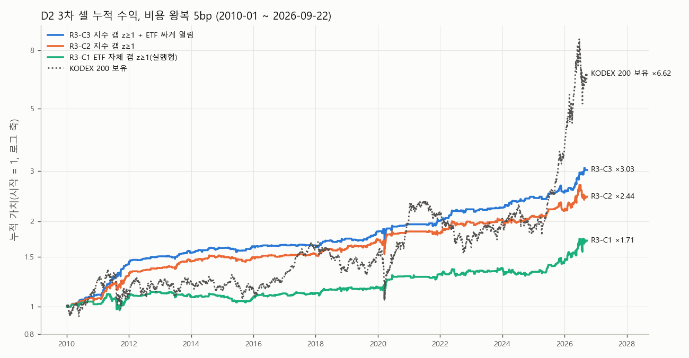

# D2 3차 전략 백테스트 2010-01 ~ 2026-09-22

```
D2 3차 셀 전략 백테스트 2010-01 ~ 2026-09 (성과 보고용, 판정 아님)

매매 규칙(3차 고정 사양 round3_D2/spec.json 그대로, 파라미터 변경 없음)
- 전날 밤: 직전 250거래일(T 제외, 유효 200행 이상)로 회귀 g = a + b·us 를 추정한다.
    g  = 코스피200 시가 갭 ln(시가(T) / 종가(T−1))
    us = 한국 T 이전에 끝난 미국 S&P500 세션들의 종가 누적 로그수익(미국 종가는 06:00 KST 무렵 확정)
    s  = 회귀 잔차 표준편차
- 아침: 갭 잔차 z = (g − a − b·us) / s 를 계산한다(= 미국으로 설명되지 않은 갭이 평소의 몇 배인지).
- R3-C1: KODEX 200 자체 시가 갭으로 만든 z ≥ 1   → 09:00 시가 매수, 15:30 종가 매도
- R3-C2: 코스피200 지수 시가 갭으로 만든 z ≥ 1  → 같은 방식(2차 D2-C1 과 같은 규칙)
- R3-C3: R3-C2 조건 + KODEX 시가가 지수 대비 싸게 열림
         (ln(ETF 시가/지수 시가) ≤ 직전 5일 ln(ETF 종가/지수 종가) 중앙값) → 같은 방식
- 롱 전용, 하루 1회, 비용 왕복 5bp(팀 기준 수수료 3bp + 슬리피지 2bp), 스트레스 7bp
- 가정: 백테스트는 09:00 시가를 신호로 쓰고 같은 시가 단일가에 체결된다고 둔다. 실거래는 08:59 예상지수·예상체결가로
  신호를 내야 하며, 그 근사 오차는 과거 자료가 없어 반영하지 못했다.
기준선: 매일 시가 매수·종가 매도(같은 비용), KODEX 200 매수 보유(비용 없음)
```

표본: 신호 계산 가능 거래일 4117일(2010-01-04~2026-09-22). 미국 S&P500 종가가 2026-09-21 세션까지(09-22 행은 종가 결측)라 마지막 신호일은 2026-09-22.

## 누적 수익(비용 5bp, 로그 축. 매일 시가→종가 기준선은 ×0.05 라 표에만 표시)



## 구간별 성과 (비용 5bp)

| 구간              | 전략           | 기간                    |   거래일 |   거래 | 노출     | 승률    |   거래당순bp | 누적수익   | 연환산    | 연변동성   |    샤프 | MDD    |    칼마 |
|:----------------|:-------------|:----------------------|------:|-----:|:-------|:------|---------:|:-------|:-------|:-------|------:|:-------|------:|
| 전체              | R3-C3        | 2010-01-04~2026-09-22 |  4117 |  407 | 9.9%   | 62.7% |    27.9  | 203.1% | 7.0%   | 5.7%   |  1.22 | -9.4%  |  0.75 |
| 전체              | R3-C2        | 2010-01-04~2026-09-22 |  4117 |  584 | 14.2%  | 59.2% |    15.99 | 144.0% | 5.6%   | 7.1%   |  0.8  | -11.4% |  0.49 |
| 전체              | R3-C1        | 2010-01-04~2026-09-22 |  4117 |  561 | 13.6%  | 54.4% |    10.39 | 70.9%  | 3.3%   | 7.6%   |  0.47 | -12.4% |  0.27 |
| 전체              | 매일 시가→종가     | 2010-01-04~2026-09-22 |  4117 | 4117 | 100.0% | 46.8% |    -6.69 | -94.9% | -16.6% | 16.0%  | -1.05 | -95.4% | -0.17 |
| 전체              | KODEX 200 보유 | 2010-01-04~2026-09-22 |  4117 | 4117 | 100.0% | 53.4% |     5.59 | 562.5% | 12.3%  | 22.5%  |  0.63 | -40.8% |  0.3  |
| 2010~2019       | R3-C3        | 2010-01-04~2019-12-30 |  2466 |  235 | 9.5%   | 61.7% |    26.27 | 83.9%  | 6.4%   | 4.1%   |  1.54 | -3.6%  |  1.8  |
| 2010~2019       | R3-C2        | 2010-01-04~2019-12-30 |  2466 |  320 | 13.0%  | 59.4% |    17.46 | 72.8%  | 5.7%   | 4.9%   |  1.17 | -6.3%  |  0.92 |
| 2010~2019       | R3-C1        | 2010-01-04~2019-12-30 |  2466 |  315 | 12.8%  | 53.0% |     5.45 | 17.3%  | 1.6%   | 5.0%   |  0.35 | -12.4% |  0.13 |
| 2010~2019       | 매일 시가→종가     | 2010-01-04~2019-12-30 |  2466 | 2466 | 100.0% | 45.7% |    -7.65 | -85.8% | -18.1% | 11.8%  | -1.63 | -86.6% | -0.21 |
| 2010~2019       | KODEX 200 보유 | 2010-01-04~2019-12-30 |  2466 | 2466 | 100.0% | 52.5% |     2.21 | 53.7%  | 4.5%   | 15.2%  |  0.36 | -27.4% |  0.16 |
| 2020~2025-06-05 | R3-C3        | 2020-01-02~2025-06-05 |  1333 |  127 | 9.5%   | 63.8% |    22.87 | 32.0%  | 5.4%   | 6.9%   |  0.8  | -9.4%  |  0.57 |
| 2020~2025-06-05 | R3-C2        | 2020-01-02~2025-06-05 |  1333 |  191 | 14.3%  | 59.7% |    11.93 | 23.4%  | 4.1%   | 8.1%   |  0.53 | -11.3% |  0.36 |
| 2020~2025-06-05 | R3-C1        | 2020-01-02~2025-06-05 |  1333 |  174 | 13.1%  | 55.2% |     9.52 | 16.0%  | 2.8%   | 8.1%   |  0.39 | -10.6% |  0.27 |
| 2020~2025-06-05 | 매일 시가→종가     | 2020-01-02~2025-06-05 |  1333 | 1333 | 100.0% | 47.3% |    -7.08 | -63.7% | -17.4% | 16.1%  | -1.11 | -68.8% | -0.25 |
| 2020~2025-06-05 | KODEX 200 보유 | 2020-01-02~2025-06-05 |  1333 | 1333 | 100.0% | 52.6% |     3.59 | 43.5%  | 7.1%   | 21.0%  |  0.43 | -34.6% |  0.2  |
| 2025-06-09~     | R3-C3        | 2025-06-09~2026-09-22 |   318 |   45 | 14.2%  | 64.4% |    50.58 | 24.8%  | 19.2%  | 9.5%   |  1.9  | -5.6%  |  3.43 |
| 2025-06-09~     | R3-C2        | 2025-06-09~2026-09-22 |   318 |   73 | 23.0%  | 57.5% |    20.13 | 14.4%  | 11.3%  | 14.0%  |  0.83 | -11.4% |  0.99 |
| 2025-06-09~     | R3-C1        | 2025-06-09~2026-09-22 |   318 |   72 | 22.6%  | 58.3% |    34.14 | 25.6%  | 19.8%  | 16.9%  |  1.16 | -10.1% |  1.97 |
| 2025-06-09~     | 매일 시가→종가     | 2025-06-09~2026-09-22 |   318 |  318 | 100.0% | 53.5% |     2.34 | 0.1%   | 0.1%   | 33.9%  |  0.17 | -43.7% |  0    |
| 2025-06-09~     | KODEX 200 보유 | 2025-06-09~2026-09-22 |   318 |  318 | 100.0% | 64.2% |    40.25 | 200.2% | 139.0% | 53.6%  |  1.89 | -40.8% |  3.41 |
| 3년              | R3-C3        | 2023-09-22~2026-09-22 |   728 |   87 | 12.0%  | 65.5% |    36.65 | 36.6%  | 11.4%  | 7.1%   |  1.56 | -5.6%  |  2.03 |
| 3년              | R3-C2        | 2023-09-22~2026-09-22 |   728 |  145 | 19.9%  | 60.7% |    15.32 | 23.0%  | 7.4%   | 10.3%  |  0.74 | -11.4% |  0.65 |
| 3년              | R3-C1        | 2023-09-22~2026-09-22 |   728 |  145 | 19.9%  | 57.2% |    18.57 | 28.2%  | 9.0%   | 12.2%  |  0.77 | -10.1% |  0.89 |
| 3년              | 매일 시가→종가     | 2023-09-22~2026-09-22 |   728 |  728 | 100.0% | 51.2% |    -2.5  | -23.7% | -9.0%  | 24.7%  | -0.26 | -43.7% | -0.21 |
| 3년              | KODEX 200 보유 | 2023-09-22~2026-09-22 |   728 |  728 | 100.0% | 58.4% |    20.36 | 254.9% | 55.0%  | 38.7%  |  1.33 | -40.8% |  1.35 |
| 1년              | R3-C3        | 2025-09-22~2026-09-22 |   244 |   41 | 16.8%  | 61.0% |    45.61 | 19.9%  | 20.6%  | 10.6%  |  1.83 | -5.6%  |  3.68 |
| 1년              | R3-C2        | 2025-09-22~2026-09-22 |   244 |   68 | 27.9%  | 54.4% |    15.45 | 9.7%   | 10.1%  | 15.8%  |  0.69 | -11.4% |  0.88 |
| 1년              | R3-C1        | 2025-09-22~2026-09-22 |   244 |   64 | 26.2%  | 56.2% |    32.28 | 20.9%  | 21.6%  | 19.0%  |  1.12 | -10.1% |  2.15 |
| 1년              | 매일 시가→종가     | 2025-09-22~2026-09-22 |   244 |  244 | 100.0% | 53.3% |     0.99 | -4.5%  | -4.7%  | 38.0%  |  0.07 | -43.7% | -0.11 |
| 1년              | KODEX 200 보유 | 2025-09-22~2026-09-22 |   244 |  244 | 100.0% | 63.1% |    42.75 | 138.0% | 144.8% | 60.4%  |  1.78 | -40.8% |  3.55 |
| 3개월             | R3-C3        | 2026-06-22~2026-09-22 |    65 |    8 | 12.3%  | 50.0% |    59.75 | 4.7%   | 19.6%  | 11.5%  |  1.61 | -1.9%  | 10.08 |
| 3개월             | R3-C2        | 2026-06-22~2026-09-22 |    65 |   16 | 24.6%  | 43.8% |   -41.88 | -6.9%  | -24.1% | 18.1%  | -1.44 | -11.4% | -2.12 |
| 3개월             | R3-C1        | 2026-06-22~2026-09-22 |    65 |   15 | 23.1%  | 46.7% |    13.05 | 1.0%   | 3.9%   | 28.0%  |  0.27 | -10.1% |  0.39 |
| 3개월             | 매일 시가→종가     | 2026-06-22~2026-09-22 |    65 |   65 | 100.0% | 38.5% |   -65.4  | -37.0% | -83.3% | 52.3%  | -3.15 | -43.7% | -1.91 |
| 3개월             | KODEX 200 보유 | 2026-06-22~2026-09-22 |    65 |   65 | 100.0% | 55.4% |   -28.48 | -23.7% | -64.9% | 82.8%  | -0.87 | -40.8% | -1.59 |

## 구간별 성과 (비용 7bp, 스트레스)

| 구간              | 전략           | 기간                    |   거래일 |   거래 | 노출     | 승률    |   거래당순bp | 누적수익   | 연환산    | 연변동성   |    샤프 | MDD    |    칼마 |
|:----------------|:-------------|:----------------------|------:|-----:|:-------|:------|---------:|:-------|:-------|:-------|------:|:-------|------:|
| 전체              | R3-C3        | 2010-01-04~2026-09-22 |  4117 |  407 | 9.9%   | 62.4% |    25.9  | 179.5% | 6.5%   | 5.7%   |  1.14 | -9.4%  |  0.69 |
| 전체              | R3-C2        | 2010-01-04~2026-09-22 |  4117 |  584 | 14.2%  | 58.7% |    13.99 | 117.1% | 4.9%   | 7.1%   |  0.7  | -11.6% |  0.42 |
| 전체              | R3-C1        | 2010-01-04~2026-09-22 |  4117 |  561 | 13.6%  | 53.5% |     8.39 | 52.7%  | 2.6%   | 7.6%   |  0.38 | -13.0% |  0.2  |
| 전체              | 매일 시가→종가     | 2010-01-04~2026-09-22 |  4117 | 4117 | 100.0% | 45.6% |    -8.69 | -97.7% | -20.7% | 16.0%  | -1.37 | -97.9% | -0.21 |
| 전체              | KODEX 200 보유 | 2010-01-04~2026-09-22 |  4117 | 4117 | 100.0% | 53.4% |     5.59 | 562.5% | 12.3%  | 22.5%  |  0.63 | -40.8% |  0.3  |
| 2010~2019       | R3-C3        | 2010-01-04~2019-12-30 |  2466 |  235 | 9.5%   | 61.7% |    24.27 | 75.5%  | 5.9%   | 4.1%   |  1.43 | -4.0%  |  1.49 |
| 2010~2019       | R3-C2        | 2010-01-04~2019-12-30 |  2466 |  320 | 13.0%  | 59.1% |    15.46 | 62.1%  | 5.1%   | 4.9%   |  1.04 | -6.3%  |  0.8  |
| 2010~2019       | R3-C1        | 2010-01-04~2019-12-30 |  2466 |  315 | 12.8%  | 51.7% |     3.45 | 10.1%  | 1.0%   | 5.0%   |  0.22 | -13.0% |  0.08 |
| 2010~2019       | 매일 시가→종가     | 2010-01-04~2019-12-30 |  2466 | 2466 | 100.0% | 44.5% |    -9.65 | -91.4% | -22.1% | 11.8%  | -2.06 | -91.6% | -0.24 |
| 2010~2019       | KODEX 200 보유 | 2010-01-04~2019-12-30 |  2466 | 2466 | 100.0% | 52.5% |     2.21 | 53.7%  | 4.5%   | 15.2%  |  0.36 | -27.4% |  0.16 |
| 2020~2025-06-05 | R3-C3        | 2020-01-02~2025-06-05 |  1333 |  127 | 9.5%   | 63.0% |    20.87 | 28.7%  | 4.9%   | 6.9%   |  0.73 | -9.4%  |  0.52 |
| 2020~2025-06-05 | R3-C2        | 2020-01-02~2025-06-05 |  1333 |  191 | 14.3%  | 58.6% |     9.93 | 18.8%  | 3.3%   | 8.1%   |  0.44 | -11.5% |  0.29 |
| 2020~2025-06-05 | R3-C1        | 2020-01-02~2025-06-05 |  1333 |  174 | 13.1%  | 54.6% |     7.52 | 12.0%  | 2.2%   | 8.1%   |  0.3  | -10.6% |  0.2  |
| 2020~2025-06-05 | 매일 시가→종가     | 2020-01-02~2025-06-05 |  1333 | 1333 | 100.0% | 46.1% |    -9.08 | -72.2% | -21.5% | 16.1%  | -1.43 | -74.3% | -0.29 |
| 2020~2025-06-05 | KODEX 200 보유 | 2020-01-02~2025-06-05 |  1333 | 1333 | 100.0% | 52.6% |     3.59 | 43.5%  | 7.1%   | 21.0%  |  0.43 | -34.6% |  0.2  |
| 2025-06-09~     | R3-C3        | 2025-06-09~2026-09-22 |   318 |   45 | 14.2%  | 64.4% |    48.58 | 23.7%  | 18.4%  | 9.5%   |  1.83 | -5.7%  |  3.23 |
| 2025-06-09~     | R3-C2        | 2025-06-09~2026-09-22 |   318 |   73 | 23.0%  | 57.5% |    18.13 | 12.8%  | 10.0%  | 14.0%  |  0.75 | -11.6% |  0.86 |
| 2025-06-09~     | R3-C1        | 2025-06-09~2026-09-22 |   318 |   72 | 22.6%  | 58.3% |    32.14 | 23.9%  | 18.5%  | 16.8%  |  1.09 | -10.2% |  1.81 |
| 2025-06-09~     | 매일 시가→종가     | 2025-06-09~2026-09-22 |   318 |  318 | 100.0% | 52.2% |     0.34 | -6.0%  | -4.8%  | 33.9%  |  0.03 | -44.1% | -0.11 |
| 2025-06-09~     | KODEX 200 보유 | 2025-06-09~2026-09-22 |   318 |  318 | 100.0% | 64.2% |    40.25 | 200.2% | 139.0% | 53.6%  |  1.89 | -40.8% |  3.41 |

## 연도별 (비용 5bp)

연수익(괄호 = 거래 수)

|   연도 | R3-C3       | R3-C2       | R3-C1       | 매일 시가→종가   | KODEX 200 보유   |
|-----:|:------------|:------------|:------------|:-----------|:---------------|
| 2010 | +10.2% (18) | +6.7% (20)  | +2.0% (12)  | +1.2%      | +23.9%         |
| 2011 | +28.0% (36) | +20.5% (50) | +5.0% (58)  | -37.2%     | -10.7%         |
| 2012 | +6.6% (14)  | +6.4% (15)  | +5.1% (18)  | -15.6%     | +11.3%         |
| 2013 | +2.9% (29)  | +5.6% (40)  | -3.2% (36)  | -26.9%     | +1.1%          |
| 2014 | +4.0% (24)  | +3.8% (32)  | -0.6% (26)  | -22.0%     | -6.6%          |
| 2015 | +1.4% (24)  | -0.3% (33)  | -0.4% (34)  | -13.9%     | -0.1%          |
| 2016 | +1.1% (18)  | +1.3% (24)  | +3.1% (31)  | -9.4%      | +10.2%         |
| 2017 | -0.3% (19)  | +1.4% (31)  | +0.3% (36)  | -8.4%      | +27.1%         |
| 2018 | +5.6% (26)  | +4.2% (39)  | +4.0% (35)  | -27.3%     | -17.3%         |
| 2019 | +5.9% (27)  | +8.1% (36)  | +1.0% (29)  | -10.9%     | +14.4%         |
| 2020 | +6.1% (18)  | +6.5% (30)  | +9.2% (29)  | -0.2%      | +35.6%         |
| 2021 | +2.9% (19)  | -1.3% (24)  | +1.5% (15)  | -30.3%     | +3.0%          |
| 2022 | +9.7% (35)  | +8.8% (50)  | +2.4% (43)  | -28.0%     | -24.2%         |
| 2023 | +1.4% (19)  | +2.5% (29)  | +2.7% (30)  | -8.3%      | +24.9%         |
| 2024 | +9.2% (29)  | +3.1% (46)  | -3.0% (44)  | -26.4%     | -9.4%          |
| 2025 | +3.5% (21)  | +4.3% (31)  | +9.0% (38)  | +19.4%     | +94.2%         |
| 2026 | +20.2% (31) | +12.1% (54) | +18.2% (47) | -10.0%     | +85.1%         |


## 읽는 법

- 성과 보고용 백테스트다. 셀 판정은 3차 보고서(2003~2009 H0)와 2차 보고서(2020~2025-06 B)를 따른다. 규칙과 파라미터는 3차 사양 그대로다.
- R3-C2·C3 의 수익은 '09:00 시가를 보고 같은 시가 단일가에 체결' 가정 위에 있다. 실거래는 08:59 예상지수(C2)와 ETF 예상체결가(C3)가 필요하다.
- R3-C1 은 ETF 예상체결가만 있으면 되는 실행형이지만 2003~2009 판정에서 기각됐다.
- 2023-07-31(선물 08:45 개장) 이후 ETF 시가 과소 반영 몫이 C2 에서 사라졌다. 최근 구간 성과를 해석할 때 참고한다.
- 일별 신호·수익은 `daily_returns.csv`, 표는 `summary.csv`·`yearly.csv` 에 있다.